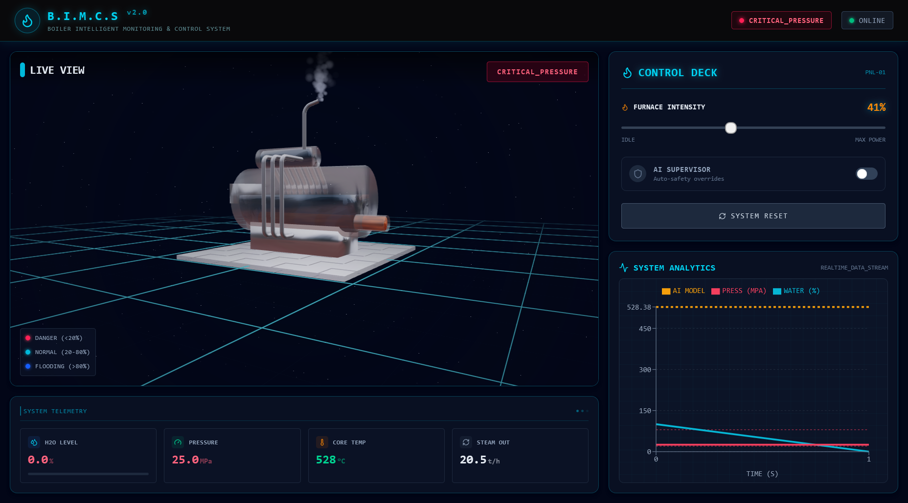
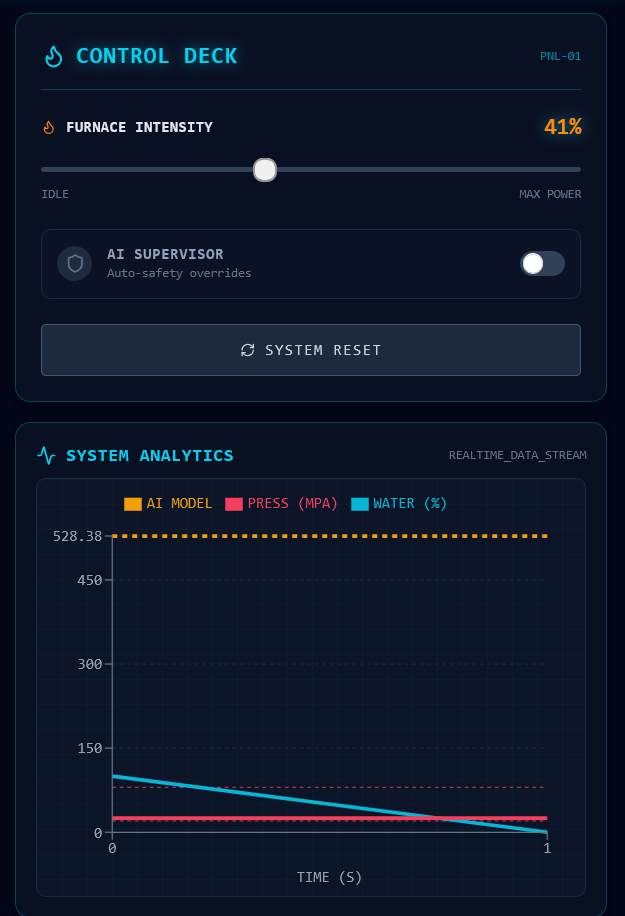

# B.I.M.C.S - Boiler Intelligent Monitoring & Control System

**B.I.M.C.S** is a cutting-edge Industrial Digital Twin application designed to simulate, monitor, and control industrial steam boilers. It combines a high-fidelity 3D visualization with an advanced AI predictive backend to ensure safe and efficient boiler operations.

## 📸 Screenshots

### Dashboard Overview
<!-- Add a screenshot of the main 3D dashboard here -->


### Control Panel & Telemetry
<!-- Add a screenshot of the control panel and charts here -->


---

## 🚀 Use Case & Features

This application serves as a **Digital Twin** for industrial operators and training simulations. It solves the critical problem of boiler steam temperature control, where delays in thermal response can lead to dangerous pressure build-ups or inefficient steam generation.

### Key Capabilities
-   **3D Digital Twin**: A real-time, interactive 3D model of the drum boiler, visualizing water levels, fire intensity, steam generation, and smoke emissions.
-   **AI Predictive Supervisor**: An LSTM-based neural network that predicts steam temperature 30 seconds into the future.
-   **Intelligent Control**: An AI Supervisor that proactively intervenes (clamps fire intensity) if it predicts dangerous temperature spikes, preventing accidents before they occur.
-   **Real-time Telemetry**: Live graphing of temperature trends comparing actual values vs. AI predictions.

---

## 🏗️ Architecture

The application follows a modern decoupled architecture:

### Frontend (React + Three.js)
-   **Framework**: React 19 with Vite.
-   **Visualization**: `react-three-fiber` and `drei` for rendering the 3D boiler model.
-   **Styling**: Tailwind CSS v4 for a futuristic "Sci-Fi Industrial" interface.
-   **State Management**: Complex simulation state (physics + visual effects) synced with the backend.

### Backend (FastAPI + AI)
-   **API**: FastAPI server handling simulation steps and prediction requests.
-   **Physics Engine**: A custom Python-based physics simulation for drum boiler dynamics (Water Level, Pressure, Temperature).
-   **AI Model**: TensorFlow/Keras LSTM model trained on historical boiler data to predict future states.

---

## 🔌 API Details

The backend exposes a REST API for the frontend to interact with:

| Method | Endpoint | Description |
| :--- | :--- | :--- |
| `POST` | `/simulate` | Runs one simulation step. Accepts user input (fire), returns updated physics state + AI predictions. |
| `POST` | `/predict` | Standalone endpoint to get a 30-step temperature forecast based on current control inputs. |
| `POST` | `/reset` | Resets the simulation to safe initial conditions. |
| `GET` | `/health` | Checks if the AI model and Physics engine are loaded and healthy. |

---

## ⚡ Quick Installation

### Prerequisites
-   Node.js (v18+)
-   Python (3.9+)

### 1. Backend Setup
```bash
cd backend
# Create virtual environment (optional but recommended)
python -m venv .venv
# Activate: .venv\Scripts\activate (Windows) or source .venv/bin/activate (Mac/Linux)

# Install dependencies
pip install -r requirements.txt

# Start the server
python main.py
```
*Server runs on `http://localhost:8000`*

### 2. Frontend Setup
```bash
cd frontend
# Install dependencies
npm install

# Start the development server
npm run dev
```
*App runs on `http://localhost:5173`*

---

## 🎨 Simulation Controls

Once the app is running:
1.  **Fire Intensity**: Use the slider to increase/decrease furnace heat.
2.  **AI Mode**: Toggle "AI Supervisor" to enable automatic safety interventions.
3.  **Visuals**: Watch the water level drop and pressure rise as heat increases.