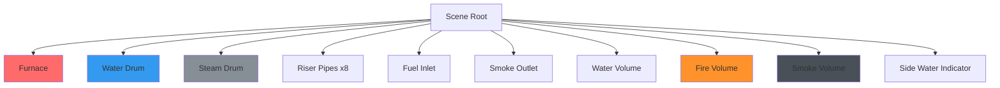
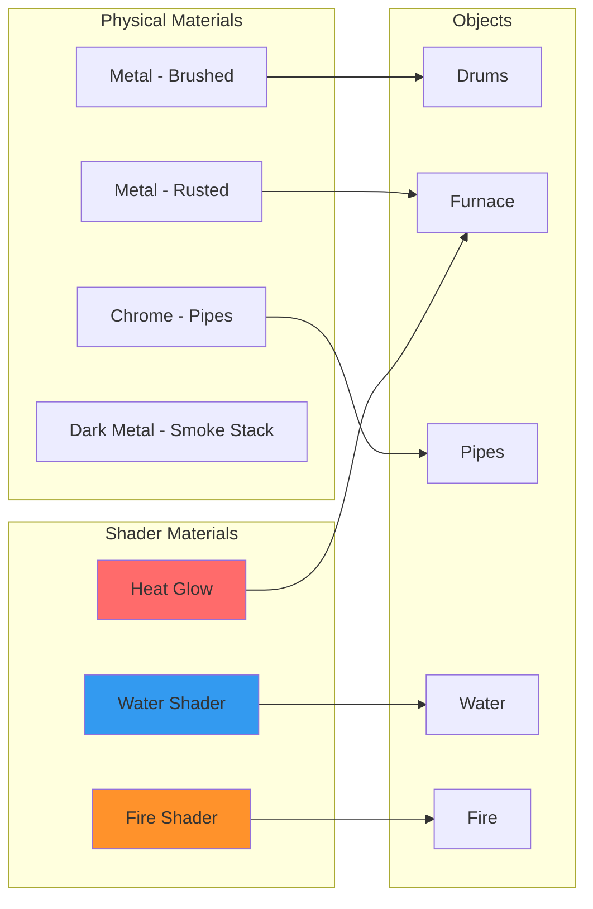
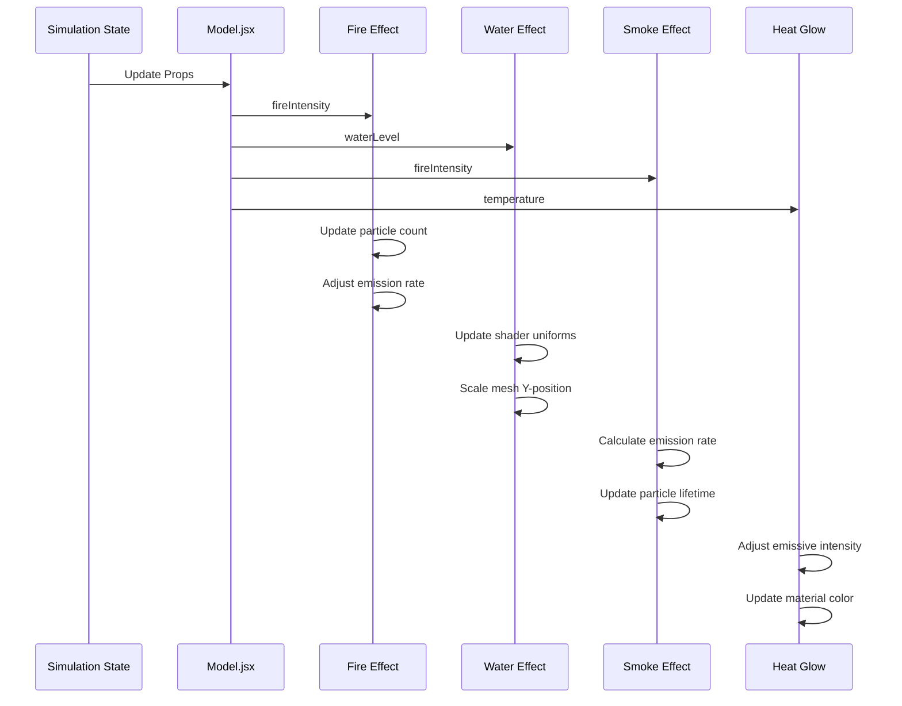
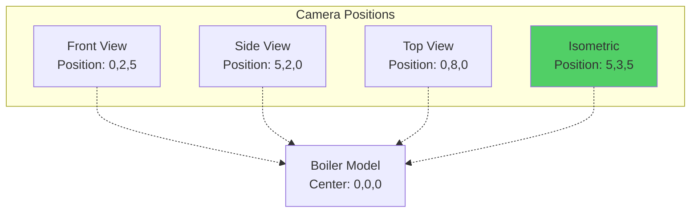

# 3D Model Documentation

## Overview

The B.I.M.C.S 3D boiler model is a photorealistic glTF asset that represents an industrial drum boiler system. It combines static geometry with dynamic visual effects to create an immersive digital twin experience.

## Model Specifications

### File Information

| Property | Value |
|----------|-------|
| **Format** | glTF 2.0 Binary (.glb) |
| **Total Objects** | 25 |
| **Total Vertices** | ~3,500 |
| **Total Faces** | ~3,000 |
| **File Size** | ~2 MB (estimated) |
| **Materials** | 4 unique materials |

### Scene Composition



## Model Components

### 1. Furnace

**Purpose**: Main combustion chamber

**Properties**:
- **Location**: `[-0.0029, -0.0509, 1.5499]`
- **Scale**: `[1.0, 1.0, 1.98]` (stretched vertically)
- **Rotation**: `[0°, 0°, 0°]`
- **Material**: Metallic with rust/wear texture
- **Vertex Count**: 130
- **Face Count**: 124

**Visual Features**:
- Emissive material responds to fire intensity
- Heat glow effect increases with temperature
- Rust and wear details for industrial realism

### 2. Water Drum

**Purpose**: Lower drum containing feedwater

**Properties**:
- **Location**: `[0.0, 0.0, -0.4738]`
- **Scale**: `[0.3271, 0.3271, 1.0695]`
- **Material**: Brushed metal cylinder
- **Vertex Count**: 130
- **Face Count**: 124

**Dynamic Features**:
- Water level indicator mesh scales vertically
- Side gauge shows fill percentage
- Steam generation rate affects visual distortion

### 3. Steam Drum

**Purpose**: Upper drum collecting steam

**Properties**:
- **Location**: `[-0.7101, 0.1609, 2.8478]`
- **Scale**: `[0.3271, 0.3271, 1.0137]`
- **Material**: Polished metal
- **Vertex Count**: 130
- **Face Count**: 124

**Features**:
- Pressure indicator via material intensity
- Steam emission point for particles
- Heat shimmer effect at high pressure

### 4. Riser Pipes (8 instances)

**Purpose**: Transport hot water/steam upward

**Naming Convention**: `pipes`, `pipes.001`, ..., `pipes.007`

**Base Properties**:
- **Location Pattern**: Evenly spaced along Z-axis from `0.0601` to `-1.6179`
- **Y-Position**: `1.2403` (fixed height)
- **Material**: Chrome/steel tubing
- **Vertex Count (each)**: 152
- **Face Count (each)**: 252

**Array Layout**:

| Object | X-Position | Notes |
|--------|-----------|-------|
| pipes | 0.0601 | Rightmost |
| pipes.001 | -0.1873 | |
| pipes.002 | -0.4124 | |
| pipes.003 | -0.6598 | |
| pipes.004 | -0.8979 | |
| pipes.005 | -1.1453 | |
| pipes.006 | -1.3705 | |
| pipes.007 | -1.6179 | Leftmost |

**Visual Effects**:
- Heat shimmer along pipe length
- Steam condensation particles
- Glow based on water temperature

### 5. Additional Pipes

**Downcomers** (`pipes.008`, `pipes.009`):
- Return cooler water from steam drum to water drum
- Location: Lower positions near water drum
- Material: Standard steel

**Connection Pipes** (`pipes.012`, `pipes.013`, `pipes.014`):
- Connect drums to external systems
- Location: Various positions for feed/blowdown
- Material: Industrial piping

### 6. Fuel Inlet

**Purpose**: Fire/fuel input visualization

**Properties**:
- **Location**: `[..., ..., 0.978]` (bottom of furnace)
- **Scale**: `[..., ..., 2.2127]`
- **Material**: Grating/mesh

**Dynamic Features**:
- Glow intensity mapped to fire_intensity
- Particle emission source for fire effect
- Heat distortion at opening

### 7. Smoke Outlet

**Purpose**: Exhaust chimney

**Properties**:
- **Location**: `[..., ..., 0.6852]` (top of system)
- **Material**: Dark metal

**Effects**:
- Smoke particle emission point
- Rate increases with fire intensity
- Temperature affects smoke color (gray → black)

### 8. Water Volume

**Purpose**: Visible water mass inside drum

**Properties**:
- **Location**: `[..., ..., 1.0975]`
- **Scale**: `[..., ..., 1.7427]`
- **Material**: Custom water shader

**Shader Features**:
```glsl
// Water shader properties
uniform float waterLevel;    // 0-100%
uniform float boiling;       // 0-1
uniform vec3 baseColor;      // [0.2, 0.4, 0.8]
uniform float transparency;  // 0.8

// Effects
- Wave animation
- Refraction mapping
- Foam at surface when boiling
- Bubble particles when temp > 550°C
```

### 9. Fire Volume

**Purpose**: Combustion visualization

**Properties**:
- **Location**: `[..., ..., 0.978]` (inside furnace)
- **Scale**: `[..., ..., 2.0695]`
- **Material**: Emissive additive blend

**Particle System**:
```javascript
{
  particleCount: fireIntensity * 2,
  lifetime: 1.5 seconds,
  velocity: [0, 2, 0] + randomness,
  color: gradient(yellow → orange → red),
  size: 0.1 - 0.3 units,
  blending: AdditiveBlending
}
```

**Animation**:
- Flicker frequency increases with intensity
- Upward motion with turbulence noise
- Heat distortion post-processing

### 10. Smoke Volume

**Purpose**: Smoke simulation

**Properties**:
- **Location**: `[..., ..., 2.8478]` (at steam drum level)
- **Scale**: `[..., ..., 0.8587]`
- **Material**: Volumetric (no solid mesh)

**Particle System**:
```javascript
{
  particleCount: smokeAmount * 50,
  lifetime: 3-5 seconds,
  velocity: [0, 1.5, 0] + wind,
  color: rgba(100, 100, 100, opacity),
  size: 0.5 - 1.2 units (grows over time),
  blending: NormalBlending
}
```

## Material System

### Material Breakdown



### 1. Brushed Metal

**Used By**: Water Drum, Steam Drum

**Properties**:
```json
{
  "type": "MeshStandardMaterial",
  "metalness": 0.9,
  "roughness": 0.3,
  "color": "#8899aa",
  "envMapIntensity": 1.0
}
```

### 2. Rusted Metal

**Used By**: Furnace, Structural Components

**Properties**:
```json
{
  "type": "MeshStandardMaterial",
  "metalness": 0.7,
  "roughness": 0.8,
  "color": "#aa6644",
  "normalMap": "rust_normal.png"
}
```

### 3. Chrome Pipes

**Used By**: Riser Pipes, Connection Pipes

**Properties**:
```json
{
  "type": "MeshStandardMaterial",
  "metalness": 1.0,
  "roughness": 0.1,
  "color": "#cccccc",
  "envMapIntensity": 1.5
}
```

### 4. Water Shader (Custom)

**Implementation**:
```javascript
import CustomShaderMaterial from 'three-custom-shader-material';

const waterMaterial = new CustomShaderMaterial({
  baseMaterial: THREE.MeshPhysicalMaterial,
  vertexShader: waterVertexShader,
  fragmentShader: waterFragmentShader,
  uniforms: {
    time: { value: 0 },
    waterLevel: { value: 50 },
    boiling: { value: 0 }
  },
  transparent: true,
  transmission: 0.9,
  thickness: 0.5,
  roughness: 0.1,
  metalness: 0.0
});
```

## Visual Effects Pipeline

### Effect Coordination



### Effect Parameters Mapping

| Simulation Variable | Visual Effect | Mapping Function |
|---------------------|---------------|------------------|
| `fire_intensity` (0-100) | Fire particle count | `count = intensity * 2` |
| `fire_intensity` | Fire scale | `scale = 1 + (intensity/100)` |
| `water_level` (0-100) | Water mesh position | `y = -1 + (level/100) * 2` |
| `water_level` | Water opacity | `alpha = 0.6 + (level/200)` |
| `temperature` (°C) | Furnace glow | `emissive = (temp-500)/200` |
| `temperature` | Smoke color | `gray = lerp(100, 50, temp/700)` |
| `pressure` (MPa) | Drum glow intensity | `intensity = pressure / 25` |
| `steam_generation` | Smoke rate | `rate = generation * 10` |

## Loading and Optimization

### glTF Loading

```javascript
import { useGLTF } from '@react-three/drei';

function Model(props) {
  const { scene, nodes, materials } = useGLTF('/model.glb');
  
  // Clone to avoid mutating original
  const clonedScene = useMemo(() => scene.clone(), [scene]);
  
  return <primitive object={clonedScene} {...props} />;
}

// Preload for better performance
useGLTF.preload('/model.glb');
```

### Performance Optimizations

1. **Instancing**: Riser pipes use geometry instancing
2. **LOD**: Simplified geometry for distant views (future)
3. **Frustum Culling**: Automatic in Three.js
4. **Texture Compression**: KTX2 format (future)
5. **Mesh Merging**: Static components merged where possible

### Polygon Budget

| Component | Tris | % of Total |
|-----------|------|-----------|
| Drums | 744 | 25% |
| Pipes | 2,016 | 67% |
| Furnace | 248 | 8% |
| **Total** | **~3,000** | **100%** |

**Target**: ≤ 50k triangles for smooth 60 FPS

## Camera Setup

### Recommended Configuration

```javascript
<Canvas
  camera={{
    position: [5, 3, 5],
    fov: 50,
    near: 0.1,
    far: 1000
  }}
>
```

### Viewing Angles



**Recommended**: Isometric view for best visibility of all components.

## Lighting Setup

### Scene Lighting

```javascript
<ambientLight intensity={0.5} />

<directionalLight
  position={[10, 10, 5]}
  intensity={1.0}
  castShadow
  shadow-mapSize-width={2048}
  shadow-mapSize-height={2048}
/>

<pointLight
  position={[0, 0, 1]}  // Near fire
  intensity={fireIntensity / 50}
  color="#ff6b00"
  distance={5}
/>

<Environment preset="warehouse" />
```

## Future Enhancements

### Planned Features

- [ ] **Detailed Valve Models**: Animated valve stems
- [ ] **Gauge Instruments**: 3D pressure/temperature gauges
- [ ] **Piping Network**: Extended external piping
- [ ] **Control Panel**: Physical 3D control interface
- [ ] **Structural Frame**: Surrounding platform and ladder
- [ ] **Lighting Fixtures**: Industrial work lights
- [ ] **Safety Equipment**: Fire extinguishers, safety rails

### Advanced Visual Effects

- [ ] **Volumetric Fog**: Global atmospheric effect
- [ ] **Screen Space Reflections**: Real-time reflections
- [ ] **Depth of Field**: Camera focus effects
- [ ] **Motion Blur**: During rapid camera movement
- [ ] **SSAO**: Ambient occlusion for depth
- [ ] **Bloom**: Glow around hot surfaces

---

Next: [ML Training Documentation →](ml-training.md)
