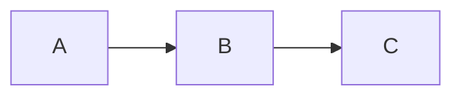

# B.I.M.C.S Documentation

This directory contains the complete documentation for the B.I.M.C.S (Boiler Intelligent Monitoring & Control System) project.

## Documentation Structure

```
docs/
├── index.md              # Project overview and introduction
├── architecture.md       # System architecture with Mermaid diagrams
├── frontend.md          # Frontend implementation details
├── backend.md           # Backend implementation details
├── api-reference.md     # API endpoint documentation
├── 3d-model.md          # 3D model structure and effects
├── ml-training.md       # Machine learning model training guide
├── tech-stack.md        # Technology stack breakdown
├── development.md       # Development setup and workflow
└── contributing.md      # Contribution guidelines
```

## Building the Documentation

### Prerequisites

Install MkDocs and dependencies:

```bash
pip install mkdocs mkdocs-material pymdown-extensions mkdocs-mermaid2-plugin
```

### Local Development

Serve documentation locally with live reloading:

```bash
# From project root
mkdocs serve
```

Open browser to `http://localhost:8001`

### Build Static Site

Generate static HTML documentation:

```bash
mkdocs build
```

Output will be in `site/` directory.

### Deploy to GitHub Pages

```bash
mkdocs gh-deploy
```

This builds the docs and pushes to the `gh-pages` branch.

## Documentation Guidelines

### Writing Style

- Use clear, concise language
- Include code examples
- Add diagrams for complex concepts
- Use admonitions for important notes

### Markdown Features

#### Code Blocks

````markdown
```python
def example():
    return "Hello"
```
````

#### Mermaid Diagrams

````markdown

````

#### Admonitions

```markdown
!!! note "Title"
    Content here

!!! warning "Caution"
    Important warning

!!! tip "Pro Tip"
    Helpful advice

!!! danger "Critical"
    Critical information
```

#### Tables

```markdown
| Column 1 | Column 2 |
|----------|----------|
| Data 1   | Data 2   |
```

#### Links

```markdown
[Text](file.md)
[External](https://example.com)
```

## Documentation Navigation

The documentation is organized into several sections:

1. **Home**: Overview and quick start
2. **Architecture**: System design and components
3. **Components**: Detailed frontend, backend, and 3D model docs
4. **Reference**: API documentation and ML training guide
5. **Development**: Setup, development workflow, and contribution guide

## Contributing to Documentation

See [contributing.md](contributing.md) for guidelines on contributing to the documentation.

### Quick Tips

- Create a new page in `docs/`
- Update `mkdocs.yml` navigation
- Use Mermaid for diagrams
- Test locally with `mkdocs serve`
- Submit pull request

## Resources

- **MkDocs**: [mkdocs.org](https://www.mkdocs.org)
- **Material Theme**: [squidfunk.github.io/mkdocs-material](https://squidfunk.github.io/mkdocs-material/)
- **Mermaid**: [mermaid.js.org](https://mermaid.js.org/)

---

Last Updated: February 2026
