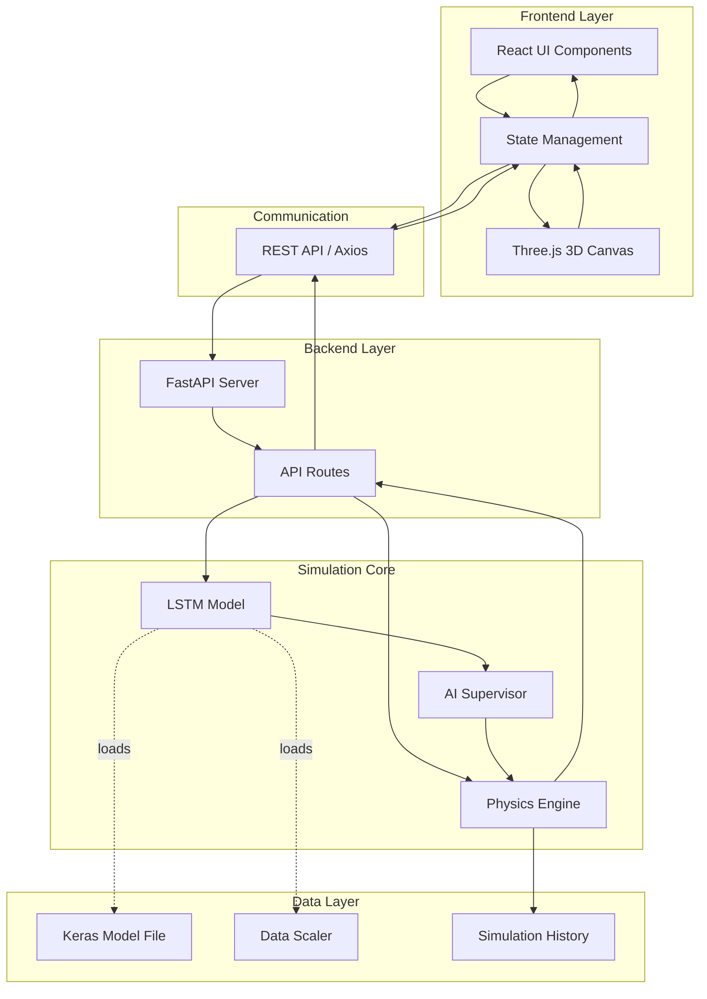
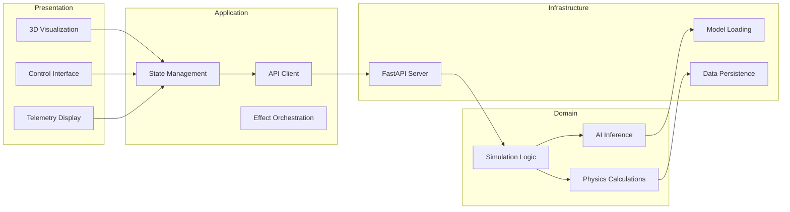
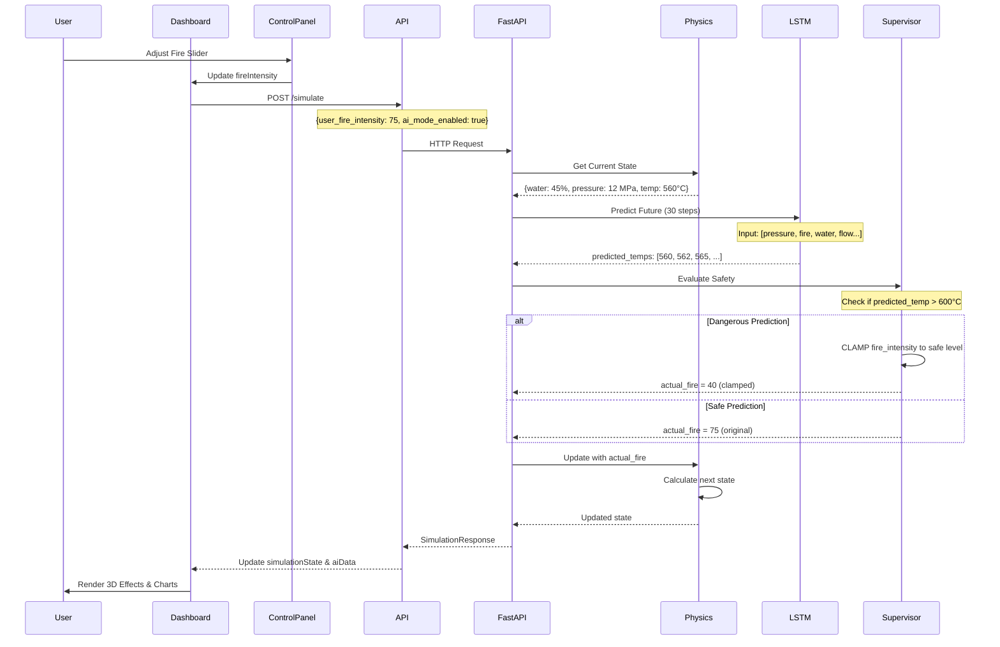
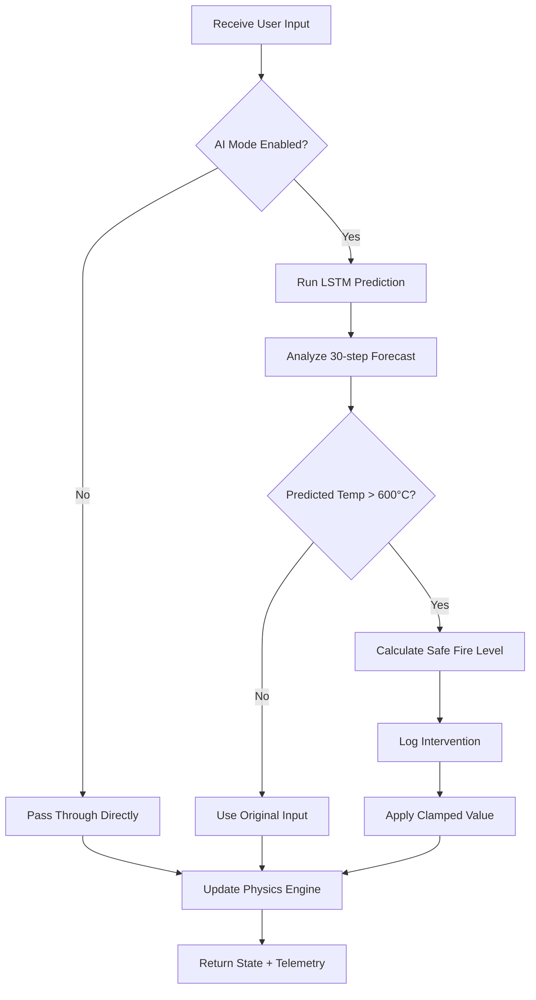
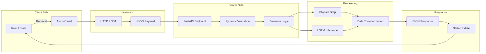
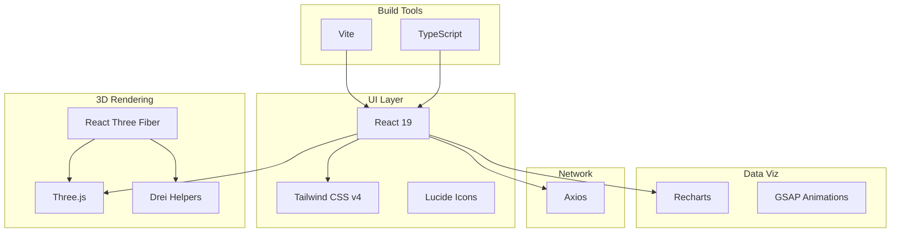
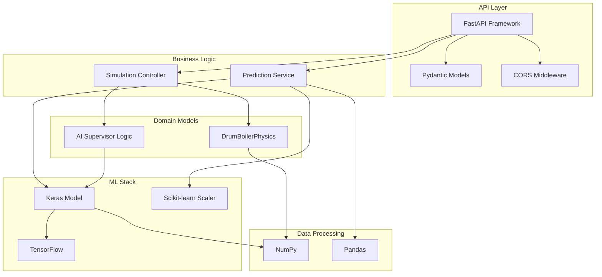
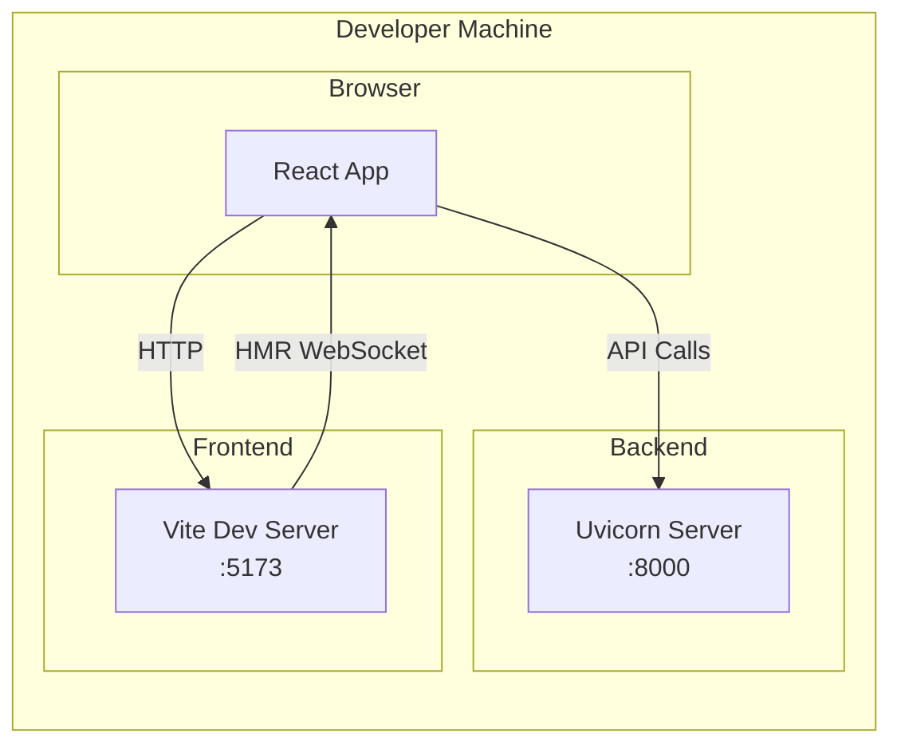
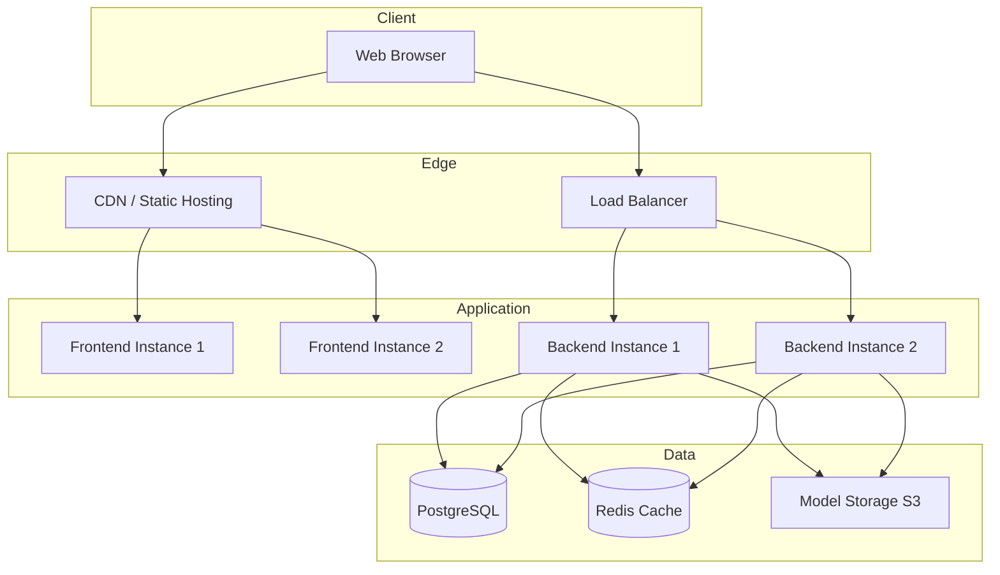
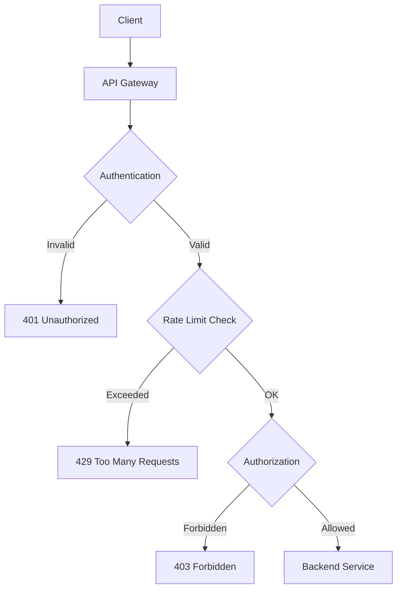

# System Architecture

## Overview

B.I.M.C.S employs a **Hybrid Digital Twin** architecture that uniquely combines deterministic physics simulation with probabilistic machine learning to create a sophisticated industrial control system.

## High-Level Architecture



## Core Design Principles

### 1. Hybrid Digital Twin Approach

The system combines two complementary modeling strategies:

| Component | Type | Role | Characteristics |
|-----------|------|------|-----------------|
| **Physics Engine** | Deterministic | Present State Calculator | Grounded in thermodynamic laws, 100% reproducible |
| **LSTM Model** | Probabilistic | Future State Predictor | Learns from data, handles uncertainty |
| **AI Supervisor** | Rule-based + ML | Safety Controller | Combines predictions with safety logic |

#### Why Hybrid?

- **Physics alone** cannot predict operator errors or equipment degradation
- **AI alone** may violate physical laws or make unrealistic predictions
- **Together** they provide grounded predictions with learned adaptability

### 2. Separation of Concerns



## Component Interaction Flow

### Simulation Loop (Every Update Cycle)



### AI Supervisor Decision Logic



## Data Flow Architecture

### Request/Response Pipeline



## Technology Stack Details

### Frontend Architecture



### Backend Architecture



## Deployment Architecture

### Development Environment



### Production Deployment (Future)



## State Management

### Frontend State Architecture

The Dashboard component acts as the central state manager:

```javascript
// User Inputs
fireIntensity: number (0-100)
aiModeEnabled: boolean

// Simulation State (from backend)
simulationState: {
  water_level: number
  pressure: number
  temperature: number
  fire_intensity: number
  steam_generation: number
}

// AI Telemetry
aiData: {
  predicted_temp_avg: number
  predicted_temp_final: number
  predicted_temps_series: number[]
  intervention_active: boolean
  intervention_reason: string
}

// System Status
systemStatus: 'NORMAL' | 'WARNING' | 'CRITICAL' | 'TRIPPED'

// UI State
loading: boolean
error: string | null
chartHistory: Array<dataPoint>
```

### Backend State Management

The physics engine maintains stateful simulation:

```python
class DrumBoilerPhysics:
    # State Variables
    water_level: float  # 0-100%
    pressure: float     # 0-25 MPa
    temperature: float  # °C
    fire_intensity: float  # 0-100%
    
    # Status
    status: str  # NORMAL, WARNING, CRITICAL, TRIPPED
    alarm_messages: List[str]
    
    # History
    history: List[Dict]  # For analysis
```

## Security Considerations

### Current Implementation (Development)

- CORS: Allow all origins (`allow_origins=["*"]`)
- No authentication
- No rate limiting
- Local execution only

### Production Requirements (Future)



Required security features:
- JWT authentication
- Role-based access control (Operator, Engineer, Admin)
- Rate limiting (per user/IP)
- Input validation and sanitization
- HTTPS/TLS encryption
- API key management for ML model access

## Scalability Considerations

### Current Limitations
- Single-threaded Python physics engine
- In-memory state (no persistence)
- Synchronous request processing
- One boiler simulation per instance

### Future Scaling Strategy
- Horizontal scaling with stateless backend
- Redis for distributed state management
- Message queue for async processing
- Multi-boiler support with isolation
- ML model caching and batching

## Performance Characteristics

| Metric | Current | Target (Production) |
|--------|---------|-------------------|
| Simulation Update Rate | ~10 Hz | 50-100 Hz |
| API Response Time | <50ms | <20ms |
| 3D Rendering FPS | 60 FPS | 60-120 FPS |
| LSTM Inference Time | ~10ms | <5ms |
| Concurrent Users | 1 | 100+ |

---

Next: [Frontend Architecture →](frontend.md)
