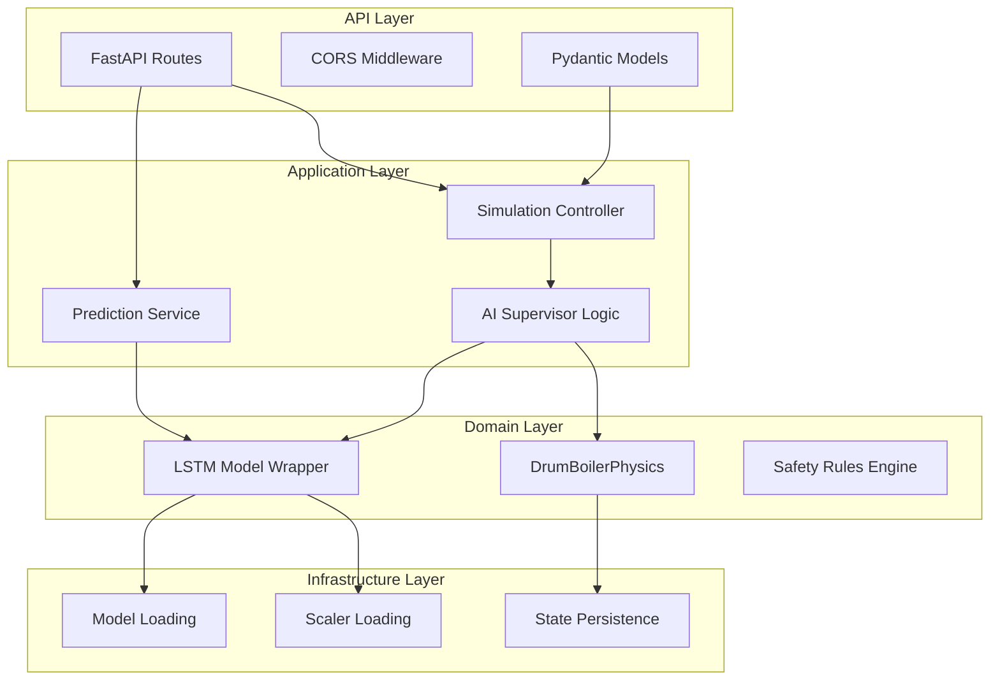
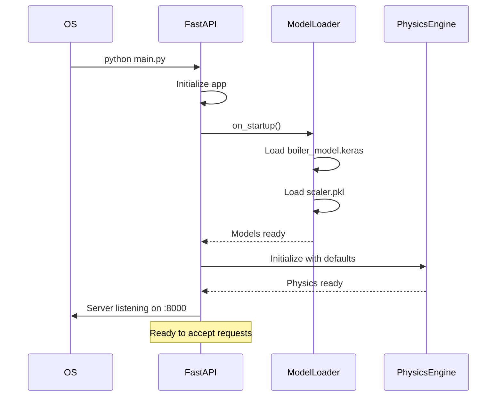
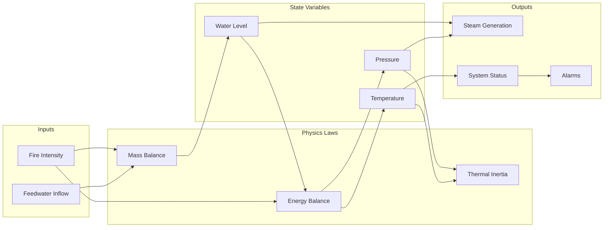
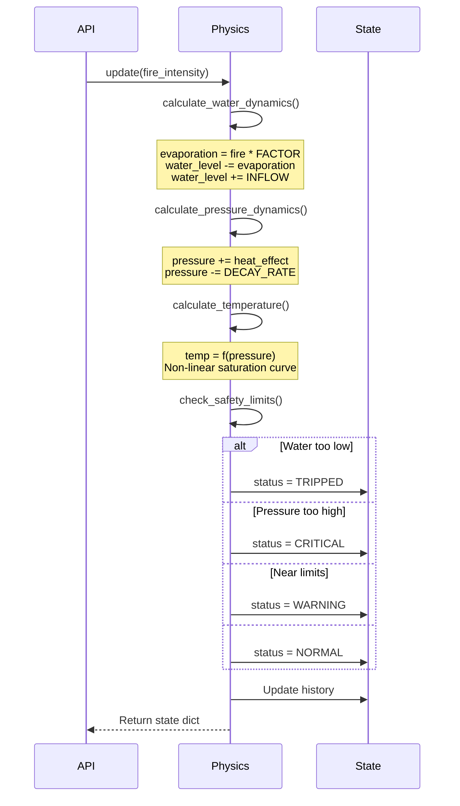
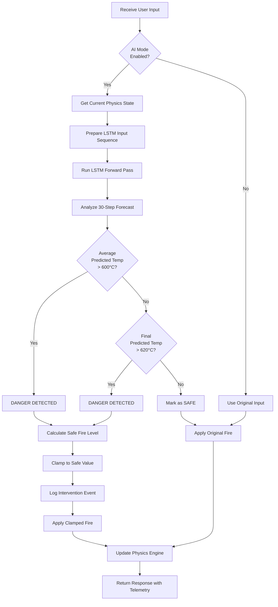
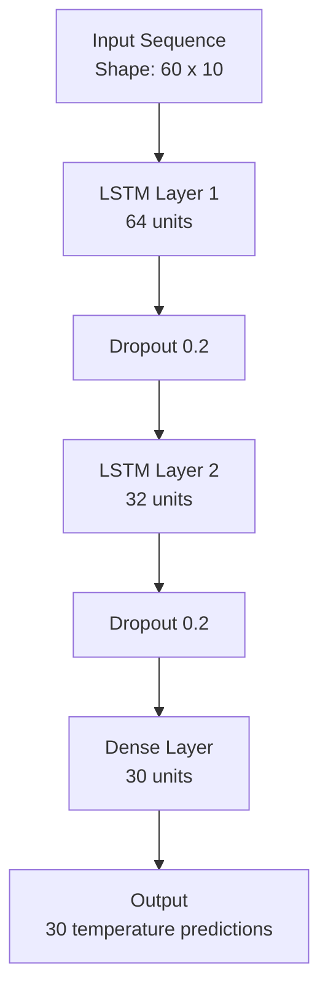

# Backend Architecture

## Overview

The B.I.M.C.S backend is a sophisticated hybrid system that combines deterministic physics simulation with probabilistic AI predictions. Built on FastAPI, it serves as the "brain" of the digital twin, computing real-time boiler dynamics and providing intelligent safety interventions.

## Technology Stack

### Core Framework
- **FastAPI**: Modern, high-performance web framework
- **Uvicorn**: Lightning-fast ASGI server
- **Pydantic**: Data validation using Python type hints

### Machine Learning
- **TensorFlow 2.x**: Deep learning framework
- **Keras**: High-level neural network API
- **scikit-learn**: Data preprocessing and scaling

### Scientific Computing
- **NumPy**: Numerical computations
- **Pandas**: Data manipulation and analysis

### Additional Tools
- **Jupyter**: Interactive model training notebooks
- **Matplotlib**: Visualization during training

## Project Structure

```
backend/
├── main.py                  # FastAPI application & AI supervisor
├── boiler_physics.py        # Physics engine
├── train_model.ipynb        # LSTM training notebook
├── boiler_model.keras       # Trained model weights
├── scaler.pkl               # Data normalization scaler
├── data.csv                 # Training dataset
├── columns.csv              # Feature column names
├── requirements.txt         # Python dependencies
├── requirements.in          # Dependency sources
├── fix_scaler.py            # Scaler repair utility
├── start_backend.sh         # Linux/Mac startup script
└── start_backend.bat        # Windows startup script
```

## Architecture Layers



## Core Components

### 1. main.py - FastAPI Application

**Responsibilities**:
- REST API endpoints
- AI Supervisor coordination
- Model loading and management
- Request/response validation

**Key Endpoints**:

```python
@app.post("/simulate")
async def simulate_step(request: SimulationRequest) -> SimulationResponse:
    """Main simulation loop with AI intervention"""
    
@app.post("/predict")  
async def predict_temperature(request: PredictionRequest) -> PredictionResponse:
    """Standalone temperature prediction"""
    
@app.post("/reset")
async def reset_simulation() -> Dict:
    """Reset physics engine to initial state"""
    
@app.get("/health")
async def health_check() -> Dict:
    """System health status"""
```

**Application Lifecycle**:



### 2. boiler_physics.py - Physics Engine

**Responsibilities**:
- Drum boiler thermodynamic simulation
- Mass and energy balance
- Safety limit monitoring
- State history tracking

**Physics Model**:



**Class Structure**:

```python
class DrumBoilerPhysics:
    # Physical Constants
    FEEDWATER_INFLOW = 15.0  # units/sec
    STEAM_CONVERSION_FACTOR = 0.5
    PRESSURE_BUILD_RATE = 1.0
    PRESSURE_DECAY_RATE = 0.1
    
    # Safety Limits
    MAX_PRESSURE = 25.0  # MPa
    MIN_WATER_LEVEL = 10.0  # %
    MAX_WATER_LEVEL = 90.0  # %
    CRITICAL_PRESSURE_THRESHOLD = 20.0  # MPa
    
    def __init__(self, initial_water_level, initial_pressure, initial_temperature):
        """Initialize boiler state"""
        
    def update(self, fire_intensity: float) -> Dict:
        """Compute one simulation step"""
        
    def calculate_water_dynamics(self) -> float:
        """Mass balance: inflow - evaporation"""
        
    def calculate_pressure_dynamics(self) -> float:
        """Energy balance: heat input - decay"""
        
    def calculate_temperature(self) -> float:
        """Temperature from pressure (saturation curve)"""
        
    def check_safety_limits(self) -> str:
        """Monitor for dangerous conditions"""
        
    def reset(self):
        """Return to initial safe state"""
```

**Update Cycle**:



**Thermodynamic Equations**:

#### Mass Balance
$$
\frac{d(WaterLevel)}{dt} = Q_{feedwater} - Q_{evaporation}
$$

Where:
- $Q_{feedwater}$ = Constant inflow (15 units/sec)
- $Q_{evaporation} = FireIntensity \times ConversionFactor$

#### Energy Balance
$$
\frac{d(Pressure)}{dt} = \alpha \cdot Q_{heat} - \beta \cdot P_{current}
$$

Where:
- $\alpha$ = Heat input coefficient (1.0)
- $Q_{heat}$ = Heat from fire
- $\beta$ = Natural decay rate (0.1)
- $P_{current}$ = Current pressure

#### Temperature-Pressure Relation
$$
T = 374 + 166 \times \left(\frac{P}{P_{max}}\right)^{0.8}
$$

Approximates the steam saturation curve.

### 3. AI Supervisor Logic

**Responsibilities**:
- Predict future temperature states
- Detect dangerous trends
- Override user input when necessary
- Log intervention events

**Decision Flow**:



**Implementation**:

```python
async def simulate_step(request: SimulationRequest):
    user_input = request.user_fire_intensity
    ai_enabled = request.ai_mode_enabled
    
    # Get current state
    current_state = physics_engine.get_state()
    
    if ai_enabled:
        # Prepare LSTM input
        features = prepare_sequence(current_state, user_input)
        
        # Predict future 30 steps
        predictions = model.predict(features)
        predicted_temps = scaler.inverse_transform(predictions)
        
        # Safety analysis
        avg_temp = np.mean(predicted_temps)
        final_temp = predicted_temps[-1]
        
        if avg_temp > 600 or final_temp > 620:
            # INTERVENTION NEEDED
            safe_fire = calculate_safe_input(current_state)
            actual_fire = min(user_input, safe_fire)
            
            intervention_active = True
            intervention_reason = f"Predicted overheat: {final_temp:.1f}°C"
        else:
            actual_fire = user_input
            intervention_active = False
    else:
        actual_fire = user_input
        intervention_active = False
    
    # Update physics with (potentially clamped) input
    new_state = physics_engine.update(actual_fire)
    
    return SimulationResponse(
        visual_state=new_state,
        ai_data={
            "predicted_temps": predicted_temps,
            "intervention_active": intervention_active,
            "original_input": user_input,
            "actual_input": actual_fire
        }
    )
```

### 4. LSTM Model Wrapper

**Model Architecture**:



**Input Features** (10 dimensions):
1. Valve Position (0-100%)
2. Furnace Pressure (MPa)
3. Fan Flow Rate (units/min)
4. Water Level (%)
5. Steam Temperature (°C)
6. Fire Intensity (%)
7. Hour of Day (0-23)
8. Normalized Time
9. Moving Average Temperature
10. Temperature Rate of Change

**Training Details**:
- **Sequence Length**: 60 time steps (60 seconds of history)
- **Forecast Horizon**: 30 steps ahead (30 seconds)
- **Loss Function**: Mean Squared Error (MSE)
- **Optimizer**: Adam with learning rate 0.001
- **Epochs**: 50 with early stopping
- **Batch Size**: 32

**Preprocessing Pipeline**:

```python
# 1. Load data
data = pd.read_csv('data.csv')

# 2. Feature engineering
data['temp_ma'] = data['temperature'].rolling(5).mean()
data['temp_rate'] = data['temperature'].diff()

# 3. Create sequences
X, y = create_sequences(data, seq_length=60, forecast=30)

# 4. Train/test split
X_train, X_test, y_train, y_test = train_test_split(X, y, test_size=0.2)

# 5. Normalization
scaler = StandardScaler()
X_train_scaled = scaler.fit_transform(X_train.reshape(-1, X_train.shape[-1]))
X_train_scaled = X_train_scaled.reshape(X_train.shape)

# 6. Train model
model.fit(X_train_scaled, y_train, epochs=50, validation_split=0.2)

# 7. Save artifacts
model.save('boiler_model.keras')
pickle.dump(scaler, open('scaler.pkl', 'wb'))
```

## Data Models (Pydantic)

### Request Models

```python
class SimulationRequest(BaseModel):
    user_fire_intensity: float = Field(..., ge=0, le=100)
    ai_mode_enabled: bool = Field(default=False)

class PredictionRequest(BaseModel):
    valve_open: float = Field(..., ge=0, le=100)
    pressure: float
    flow: float
```

### Response Models

```python
class SimulationResponse(BaseModel):
    visual_state: Dict  # For 3D rendering
    ai_data: Dict       # AI telemetry
    status: str         # NORMAL/WARNING/CRITICAL/TRIPPED

class PredictionResponse(BaseModel):
    time: List[int]
    temperature: List[float]
```

## API Endpoints Deep Dive

### POST /simulate

**Purpose**: Main simulation loop heartbeat

**Request**:
```json
{
  "user_fire_intensity": 75.0,
  "ai_mode_enabled": true
}
```

**Response**:
```json
{
  "visual_state": {
    "water_level": 45.2,
    "pressure": 12.5,
    "temperature": 565.3,
    "fire_intensity": 60.0,
    "steam_generation": 7.5
  },
  "ai_data": {
    "predicted_temp_avg": 590.2,
    "predicted_temp_final": 605.1,
    "predicted_temps_series": [565, 567, 570, ...],
    "original_user_input": 75.0,
    "actual_system_input": 60.0,
    "intervention_active": true,
    "intervention_reason": "Predicted overheat: 605.1°C",
    "ai_mode_enabled": true
  },
  "status": "WARNING"
}
```

**Processing Time**: ~15-30ms

### POST /predict

**Purpose**: Standalone prediction for trend visualization

**Request**:
```json
{
  "valve_open": 80.0,
  "pressure": 12.0,
  "flow": 500.0
}
```

**Response**:
```json
{
  "time": [1, 2, 3, ..., 30],
  "temperature": [560.0, 562.5, 565.2, ..., 590.3]
}
```

### POST /reset

**Purpose**: Emergency reset to safe state

**Response**:
```json
{
  "message": "Simulation reset to initial conditions",
  "state": {
    "water_level": 50.0,
    "pressure": 10.0,
    "temperature": 540.0
  }
}
```

### GET /health

**Purpose**: System health check

**Response**:
```json
{
  "status": "healthy",
  "model_loaded": true,
  "scaler_loaded": true,
  "physics_engine": "ready"
}
```

## Configuration

### Environment Variables (Future)

```bash
# Server
PORT=8000
HOST=0.0.0.0
RELOAD=false

# Model
MODEL_PATH=boiler_model.keras
SCALER_PATH=scaler.pkl

# Physics
INITIAL_WATER_LEVEL=50.0
INITIAL_PRESSURE=10.0
INITIAL_TEMPERATURE=540.0

# Safety
MAX_PRESSURE=25.0
CRITICAL_TEMP_THRESHOLD=600.0
```

## Error Handling

```python
try:
    # Physics update
    state = physics_engine.update(fire_intensity)
except Exception as e:
    logger.error(f"Physics error: {e}")
    raise HTTPException(status_code=500, detail="Physics simulation failed")

try:
    # LSTM prediction
    predictions = model.predict(features)
except Exception as e:
    logger.error(f"Model error: {e}")
    # Fallback: use last known prediction
    predictions = last_prediction
```

## Performance Characteristics

| Metric | Value | Notes |
|--------|-------|-------|
| Physics Update | <1ms | Pure NumPy calculations |
| LSTM Inference | 10-15ms | TensorFlow CPU |
| Total /simulate | 15-30ms | Including serialization |
| Memory Usage | ~500MB | Model + runtime |
| Startup Time | 2-3s | Model loading |

## Deployment

### Development
```bash
# Activate environment
source .venv/bin/activate

# Run with auto-reload
uvicorn main:app --reload --host 0.0.0.0 --port 8000
```

### Production (Future)
```bash
# Multi-worker setup
gunicorn main:app \
  --workers 4 \
  --worker-class uvicorn.workers.UvicornWorker \
  --bind 0.0.0.0:8000 \
  --access-logfile - \
  --error-logfile -
```

---

Next: [API Reference →](api-reference.md)
