# Contributing Guide

## Welcome!

Thank you for your interest in contributing to B.I.M.C.S! This guide will help you get started with contributing to the project.

!!! info "Early Stage Project"
    B.I.M.C.S is currently in early development. We welcome all contributions, from bug reports to major features!

## Ways to Contribute


## Getting Started

### 1. Fork the Repository

1. Visit the [B.I.M.C.S repository](https://github.com/your-org/bimcs)
2. Click "Fork" button (top right)
3. Clone your fork:

```bash
git clone https://github.com/YOUR-USERNAME/bimcs.git
cd bimcs
```

### 2. Set Up Development Environment

Follow the [Development Guide](development.md) to set up your local environment.

### 3. Create a Branch

```bash
git checkout -b feature/your-feature-name
```

**Branch Naming Convention**:

| Type | Prefix | Example |
|------|--------|---------|
| New Feature | `feature/` | `feature/multi-boiler-support` |
| Bug Fix | `fix/` | `fix/temperature-chart-crash` |
| Documentation | `docs/` | `docs/update-api-reference` |
| Refactoring | `refactor/` | `refactor/physics-engine` |
| Testing | `test/` | `test/add-backend-tests` |

## Development Workflow

### Standard Process


### Making Changes

1. **Write Code**: Follow [Code Style Guidelines](#code-style)
2. **Test**: Ensure everything works
3. **Commit**: Use [Conventional Commits](#commit-messages)
4. **Push**: Push to your fork
5. **Pull Request**: Open PR against `main` branch

## Code Style

### Python Backend

Follow **PEP 8** and use type hints:

```python
from typing import Dict, List

def calculate_pressure(
    water_level: float,
    fire_intensity: float,
    current_pressure: float
) -> float:
    """
    Calculate new pressure based on boiler dynamics.
    
    Args:
        water_level: Current water level (0-100%)
        fire_intensity: Fire intensity (0-100%)
        current_pressure: Current pressure (MPa)
    
    Returns:
        New pressure value (MPa)
    
    Raises:
        ValueError: If inputs are out of valid range
    """
    if not 0 <= water_level <= 100:
        raise ValueError("Water level must be 0-100%")
    
    heat_effect = fire_intensity * 0.01
    new_pressure = current_pressure + heat_effect - 0.1
    
    return max(0, min(new_pressure, 25.0))
```

**Formatting**:
```bash
# Install formatter
pip install black isort

# Format code
black your_file.py
isort your_file.py
```

**Linting**:
```bash
# Install linter
pip install flake8 mypy

# Check code
flake8 your_file.py
mypy your_file.py
```

---

### JavaScript/React Frontend

Follow **Airbnb JavaScript Style Guide**:

```jsx
import React, { useState, useCallback } from 'react';
import PropTypes from 'prop-types';

/**
 * TemperatureDisplay component
 * Shows current temperature with color-coded status
 */
const TemperatureDisplay = ({ value, unit = '°C', status }) => {
  const [showDetails, setShowDetails] = useState(false);
  
  const getColorClass = useCallback(() => {
    if (value > 600) return 'text-red-500';
    if (value > 580) return 'text-yellow-500';
    return 'text-green-500';
  }, [value]);
  
  return (
    <div className="temperature-display">
      <span className={getColorClass()}>
        {value.toFixed(1)}{unit}
      </span>
      <StatusIndicator status={status} />
    </div>
  );
};

TemperatureDisplay.propTypes = {
  value: PropTypes.number.isRequired,
  unit: PropTypes.string,
  status: PropTypes.oneOf(['NORMAL', 'WARNING', 'CRITICAL']).isRequired,
};

export default TemperatureDisplay;
```

**Formatting**:
```bash
# Install formatter
npm install --save-dev prettier eslint

# Format code
npx prettier --write src/
npx eslint --fix src/
```

---

## Commit Messages

Use **Conventional Commits** format:

```
<type>(<scope>): <description>

[optional body]

[optional footer]
```

### Types

| Type | Description | Example |
|------|-------------|---------|
| `feat` | New feature | `feat(backend): add multi-boiler support` |
| `fix` | Bug fix | `fix(frontend): resolve chart rendering issue` |
| `docs` | Documentation | `docs: update API reference` |
| `style` | Code style/formatting | `style(backend): format with black` |
| `refactor` | Code refactoring | `refactor(physics): optimize calculations` |
| `test` | Add/update tests | `test(backend): add LSTM inference tests` |
| `chore` | Maintenance | `chore: update dependencies` |
| `perf` | Performance improvement | `perf(frontend): optimize particle rendering` |

### Examples

```bash
# Feature
git commit -m "feat(ai): add uncertainty quantification to predictions"

# Bug fix with body
git commit -m "fix(physics): correct pressure decay calculation

The pressure decay rate was too aggressive, causing unrealistic
behavior. Adjusted PRESSURE_DECAY_RATE from 0.2 to 0.1."

# Breaking change
git commit -m "feat(api)!: change simulation response format

BREAKING CHANGE: The /simulate endpoint now returns a different
response structure. Update clients to use new format."
```

## Pull Request Guidelines

### Creating a Pull Request

1. **Title**: Clear, descriptive title
   - Good: `feat(backend): Add support for multiple boilers`
   - Bad: `Update main.py`

2. **Description**: Use the template:

```markdown
## Description
Brief description of changes

## Type of Change
- [ ] Bug fix
- [ ] New feature
- [ ] Breaking change
- [ ] Documentation update

## Changes Made
- Added multi-boiler physics engine
- Updated API to handle boiler IDs
- Added boiler selection in frontend

## Testing
- [ ] Tested locally
- [ ] Added unit tests
- [ ] Updated documentation

## Screenshots (if applicable)
[Add screenshots here]

## Related Issues
Closes #123
```

3. **Keep it Focused**: One PR = One feature/fix

4. **Update Documentation**: If you change APIs, update docs

### Code Review Process

```mermaid
sequenceDiagram
    participant You
    participant Reviewer
    participant CI
    participant Maintainer
    
    You->>Reviewer: Create Pull Request
    CI->>Reviewer: Run automated tests
    CI-->>You: Tests pass/fail
    
    alt Tests Failed
        You->>You: Fix issues
        You->>Reviewer: Push fixes
    end
    
    Reviewer->>You: Request changes
    You->>You: Address feedback
    You->>Reviewer: Push updates
    
    Reviewer->>Maintainer: Approve PR
    Maintainer->>You: Merge PR
    
    Note over You,Maintainer: 🎉 Contribution Complete!
```



**What Reviewers Look For**:
- ✅ Code follows style guidelines
- ✅ Tests pass
- ✅ No breaking changes (or properly documented)
- ✅ Documentation updated
- ✅ No security issues

## Testing

### Python Tests (Future)

```python
# tests/test_physics.py
import pytest
from boiler_physics import DrumBoilerPhysics

def test_water_level_decreases_with_fire():
    """Test that water level decreases when fire is high"""
    physics = DrumBoilerPhysics()
    initial_level = physics.water_level
    
    physics.update(fire_intensity=100)
    
    assert physics.water_level < initial_level

def test_pressure_increases_with_heat():
    """Test that pressure increases with fire intensity"""
    physics = DrumBoilerPhysics()
    initial_pressure = physics.pressure
    
    physics.update(fire_intensity=80)
    
    assert physics.pressure > initial_pressure

def test_safety_limits_trigger():
    """Test that safety limits trigger appropriately"""
    physics = DrumBoilerPhysics(initial_pressure=24.5)
    
    physics.update(fire_intensity=100)
    
    assert physics.status == "CRITICAL"
```

**Run Tests**:
```bash
cd backend
pytest tests/ -v
```

---

### JavaScript Tests (Future)

```javascript
// src/components/__tests__/Dashboard.test.jsx
import { render, screen, fireEvent } from '@testing-library/react';
import Dashboard from '../Dashboard';

describe('Dashboard', () => {
  test('renders fire intensity slider', () => {
    render(<Dashboard />);
    const slider = screen.getByRole('slider', { name: /fire intensity/i });
    expect(slider).toBeInTheDocument();
  });
  
  test('updates fire intensity on slider change', () => {
    render(<Dashboard />);
    const slider = screen.getByRole('slider');
    
    fireEvent.change(slider, { target: { value: '75' } });
    
    expect(slider.value).toBe('75');
  });
  
  test('shows warning when temperature is high', async () => {
    render(<Dashboard />);
    
    // Simulate high temperature
    // ... test implementation
    
    const warning = await screen.findByText(/warning/i);
    expect(warning).toBeInTheDocument();
  });
});
```

**Run Tests**:
```bash
cd frontend
npm test
```

## Documentation

### Writing Documentation

Documentation is written in Markdown using MkDocs.

**File Location**: `docs/`

**Creating New Page**:

1. Create file: `docs/new-page.md`
2. Update `mkdocs.yml`:
```yaml
nav:
  - New Section:
      - New Page: new-page.md
```

**Documentation Style**:

```markdown
# Page Title

## Overview

Brief introduction to the topic.

## Section

Detailed content here.

### Code Examples

```python
def example():
    return "Hello"
```

### Diagrams


!!! note "Pro Tip"
    Use admonitions for important notes.

!!! warning "Caution"
    Use warnings for critical information.
```

**Build and Preview**:
```bash
mkdocs serve
# Open http://localhost:8001
```

## Reporting Bugs

### Bug Report Template

Use this format when creating an issue:

```markdown
**Describe the Bug**
A clear description of what the bug is.

**To Reproduce**
Steps to reproduce:
1. Go to '...'
2. Click on '...'
3. See error

**Expected Behavior**
What you expected to happen.

**Screenshots**
If applicable, add screenshots.

**Environment:**
- OS: [e.g., Ubuntu 22.04]
- Python Version: [e.g., 3.11]
- Node.js Version: [e.g., 18.x]
- Browser: [e.g., Chrome 120]

**Additional Context**
Any other relevant information.
```

### Good Bug Reports

**Good Example**:
> **Title**: Temperature chart crashes when AI mode is disabled
> 
> **Description**: When disabling AI mode after it's been active, the temperature trend chart throws an error and becomes blank.
> 
> **Steps**:
> 1. Start application
> 2. Enable AI Supervisor
> 3. Wait 10 seconds
> 4. Disable AI Supervisor
> 5. Chart disappears with console error
> 
> **Error**: `TypeError: Cannot read property 'predicted_temps' of undefined`
> 
> **Environment**: Ubuntu 22.04, Chrome 120, React 19

**Bad Example**:
> Chart broken

## Feature Requests

### Feature Request Template

```markdown
**Problem Statement**
Describe the problem this feature would solve.

**Proposed Solution**
Describe your proposed solution.

**Alternatives Considered**
Other solutions you've considered.

**Additional Context**
Mockups, diagrams, or examples.
```

### Good Feature Request

**Example**:
> **Title**: Add support for multiple simultaneous boilers
> 
> **Problem**: Currently the system only simulates one boiler. Industrial plants often have multiple boilers that need monitoring.
> 
> **Solution**: 
> - Backend: Extend physics engine to handle array of boiler instances
> - API: Add boiler ID parameter to endpoints
> - Frontend: Add boiler selector dropdown
> 
> **Benefits**:
> - Fleet management capability
> - Comparative analysis
> - Load balancing visualization
> 
> **Mockup**: [Attach image]

## Community

### Communication Channels

- **GitHub Issues**: Bug reports and feature requests
- **GitHub Discussions**: General questions and ideas
- **Pull Requests**: Code contributions

### Code of Conduct

- ✅ Be respectful and professional
- ✅ Welcome newcomers
- ✅ Provide constructive feedback
- ✅ Focus on the project's goals
- ❌ No harassment or discrimination
- ❌ No spam or self-promotion

## Recognition

Contributors are recognized in:
- **README.md**: Contributors section
- **Release Notes**: Credit for features/fixes
- **Documentation**: Author attribution

## License

By contributing, you agree that your contributions will be licensed under the same license as the project.

---

## Questions?

- 📖 Check the [Development Guide](development.md)
- 📖 Read the [Architecture Documentation](architecture.md)
- 💬 Ask in GitHub Discussions
- 🐛 Open an issue for bugs

Thank you for contributing to B.I.M.C.S! 🚀
