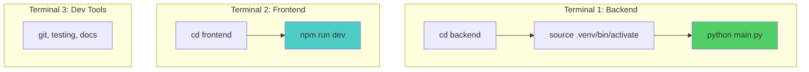
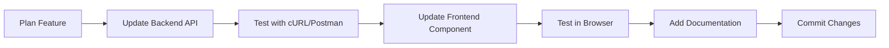
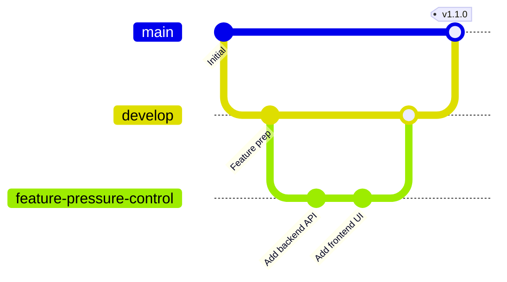

# Development Guide

## Getting Started

### Prerequisites

Before you begin, ensure you have the following installed:

| Tool | Version | Purpose |
|------|---------|---------|
| **Node.js** | 18.x or higher | Frontend build & runtime |
| **npm** | 9.x or higher | JavaScript package manager |
| **Python** | 3.9 - 3.11 | Backend runtime |
| **pip** | Latest | Python package manager |
| **Git** | Latest | Version control |

### Verify Installation

```bash
# Check Node.js
node --version  # Should show v18.x.x or higher

# Check npm
npm --version  # Should show 9.x.x or higher

# Check Python
python --version  # Should show 3.9.x - 3.11.x

# Check pip
pip --version
```

## Initial Setup

### 1. Clone Repository

```bash
git clone https://github.com/your-org/bimcs.git
cd bimcs
```

### 2. Backend Setup

#### Create Virtual Environment (Recommended)

=== "Linux/macOS"
    ```bash
    cd backend
    python -m venv .venv
    source .venv/bin/activate
    ```

=== "Windows (CMD)"
    ```cmd
    cd backend
    python -m venv .venv
    .venv\Scripts\activate.bat
    ```

=== "Windows (PowerShell)"
    ```powershell
    cd backend
    python -m venv .venv
    .venv\Scripts\Activate.ps1
    ```

#### Install Dependencies

```bash
# Ensure virtual environment is activated
pip install -r requirements.txt
```

**Expected Installation Time**: 2-3 minutes

**Key Dependencies Installed**:
- TensorFlow 2.x (~400MB)
- FastAPI + Uvicorn
- NumPy, Pandas
- scikit-learn

#### Verify Backend

```bash
# Start server
python main.py
```

Expected output:
```
INFO:     Started server process [12345]
INFO:     Waiting for application startup.
INFO:     Application startup complete.
INFO:     Uvicorn running on http://0.0.0.0:8000 (Press CTRL+C to quit)
```

Test health endpoint:
```bash
curl http://localhost:8000/health
```

Should return:
```json
{
  "status": "healthy",
  "model_loaded": true,
  "scaler_loaded": true,
  "physics_engine": "ready"
}
```

### 3. Frontend Setup

Open a **new terminal** (keep backend running):

```bash
cd frontend
npm install
```

**Expected Installation Time**: 1-2 minutes

**Key Dependencies Installed**:
- React 19
- Three.js & React Three Fiber
- Tailwind CSS v4
- Vite

#### Start Development Server

```bash
npm run dev
```

Expected output:
```
  VITE v7.2.4  ready in 823 ms

  ➜  Local:   http://localhost:5173/
  ➜  Network: use --host to expose
  ➜  press h + enter to show help
```

### 4. Access Application

Open browser to `http://localhost:5173`

You should see:
- 3D boiler model in center
- Control panel on right side
- Telemetry panels below
- Temperature chart at bottom

## Development Workflow

### Recommended Terminal Layout



### Hot Module Replacement (HMR)

Frontend changes automatically reload in browser:

1. Edit `src/components/Dashboard.jsx`
2. Save file
3. Browser updates instantly (without full refresh)

Backend changes require manual restart:

1. Edit `main.py` or `boiler_physics.py`
2. Stop server (Ctrl+C)
3. Restart: `python main.py`

!!! tip "Auto-Reload Backend"
    ```bash
    uvicorn main:app --reload --host 0.0.0.0 --port 8000
    ```

### Making Changes

#### Frontend Component

```bash
# Create new component
cd frontend/src/components
touch NewComponent.jsx
```

```jsx
// NewComponent.jsx
import React from 'react';

export default function NewComponent({ data }) {
  return (
    <div className="p-4 bg-gray-800 rounded-lg">
      <h3 className="text-xl font-bold">{data.title}</h3>
      {/* Your component logic */}
    </div>
  );
}
```

Import in Dashboard:
```jsx
import NewComponent from './components/NewComponent';

// Use in render
<NewComponent data={someData} />
```

#### Backend Endpoint

```python
# main.py
@app.post("/new-endpoint")
async def new_endpoint(data: RequestModel) -> ResponseModel:
    """
    Your endpoint description
    """
    result = process_data(data)
    return ResponseModel(result=result)
```

Add Pydantic models:
```python
class RequestModel(BaseModel):
    field1: float
    field2: str

class ResponseModel(BaseModel):
    result: Dict
```

## Project Structure

### Directory Tree

```
bimcs/
├── docs/                    # Project documentation
│   ├── index.md
│   ├── architecture.md
│   └── ...
├── backend/
│   ├── main.py             # FastAPI app
│   ├── boiler_physics.py   # Physics engine
│   ├── train_model.ipynb   # ML training
│   ├── boiler_model.keras  # Trained model
│   ├── scaler.pkl          # Data scaler
│   ├── requirements.txt    # Dependencies
│   └── .venv/              # Virtual environment
├── frontend/
│   ├── src/
│   │   ├── components/     # React components
│   │   ├── App.jsx
│   │   └── main.jsx
│   ├── public/
│   │   └── model.glb       # 3D model file
│   ├── package.json
│   └── node_modules/
├── screenshots/            # Documentation images
├── README.md
└── mkdocs.yml             # Documentation config
```

### File Responsibilities

#### Backend

| File | Purpose | Edit Frequency |
|------|---------|---------------|
| `main.py` | API routes, AI supervisor | High |
| `boiler_physics.py` | Physics simulation | Medium |
| `train_model.ipynb` | Model training | Low |
| `requirements.txt` | Dependencies | Low |

#### Frontend

| File | Purpose | Edit Frequency |
|------|---------|---------------|
| `Dashboard.jsx` | State management | High |
| `Model.jsx` | 3D rendering | Medium |
| `ControlPanel.jsx` | User inputs | Medium |
| `TrendChart.jsx` | Telemetry display | Medium |
| `*.js` (hooks) | Visual effects | Low |

## Common Tasks

### Adding a New Feature



#### Example: Add Pressure Control

1. **Backend** - Add endpoint:
```python
@app.post("/set-pressure")
async def set_pressure(target: float):
    physics_engine.target_pressure = target
    return {"message": "Pressure target updated"}
```

2. **Frontend** - Add control:
```jsx
const [targetPressure, setTargetPressure] = useState(10);

const handlePressureChange = async (value) => {
  setTargetPressure(value);
  await axios.post('/set-pressure', { target: value });
};

// In render
<input
  type="range"
  value={targetPressure}
  onChange={(e) => handlePressureChange(e.target.value)}
/>
```

3. **Test** - Verify functionality

4. **Document** - Update API docs

### Debugging

#### Backend Debugging

**Print Debugging**:
```python
print(f"Fire intensity: {fire_intensity}")
print(f"Physics state: {physics_engine.get_state()}")
```

**Logging**:
```python
import logging
logging.basicConfig(level=logging.DEBUG)
logger = logging.getLogger(__name__)

logger.debug(f"Received request: {request}")
logger.info(f"Prediction: {prediction}")
```

**Interactive Debugging (pdb)**:
```python
import pdb; pdb.set_trace()
# Execution pauses here
```

#### Frontend Debugging

**Console Logging**:
```javascript
console.log('Simulation state:', simulationState);
console.log('AI Data:', aiData);
```

**React DevTools**:
1. Install React DevTools browser extension
2. Open DevTools → Components tab
3. Inspect component props and state

**Network Tab**:
1. Open DevTools → Network tab
2. Filter: XHR
3. View API requests/responses

### Running Tests (Future)

#### Backend Tests

```bash
cd backend
pytest tests/
```

#### Frontend Tests

```bash
cd frontend
npm test
```

## Code Style Guidelines

### Python (Backend)

Follow **PEP 8**:

```python
# Good
def calculate_temperature(pressure: float, water_level: float) -> float:
    """
    Calculate temperature from pressure and water level.
    
    Args:
        pressure: Steam pressure in MPa
        water_level: Water level percentage
    
    Returns:
        Temperature in degrees Celsius
    """
    result = base_temp + pressure * coefficient
    return result

# Bad
def calcTemp(p,w):
    return baseTemp+p*coeff
```

**Tools**:
```bash
# Format code
black main.py

# Lint
flake8 main.py

# Type check
mypy main.py
```

### JavaScript/React (Frontend)

Follow **Airbnb Style Guide**:

```jsx
// Good
const Dashboard = () => {
  const [temperature, setTemperature] = useState(540);
  
  const handleUpdate = useCallback((newTemp) => {
    setTemperature(newTemp);
  }, []);
  
  return (
    <div className="dashboard">
      <TemperatureDisplay value={temperature} />
    </div>
  );
};

// Bad
function Dashboard() {
  var temp = 540;
  return <div><p>{temp}</p></div>
}
```

**Tools**:
```bash
# Format code
npx prettier --write src/

# Lint
npx eslint src/
```

## Git Workflow

### Branch Strategy



### Commit Messages

Follow **Conventional Commits**:

```bash
# Format: <type>(<scope>): <description>

git commit -m "feat(backend): add pressure control endpoint"
git commit -m "fix(frontend): correct temperature chart axis"
git commit -m "docs: update API reference for pressure endpoint"
git commit -m "refactor(physics): optimize water dynamics calculation"
```

**Types**:
- `feat`: New feature
- `fix`: Bug fix
- `docs`: Documentation
- `style`: Formatting
- `refactor`: Code restructuring
- `test`: Tests
- `chore`: Maintenance

### Pull Request Process

1. **Create feature branch**:
```bash
git checkout -b feature/my-new-feature
```

2. **Make changes and commit**:
```bash
git add .
git commit -m "feat: add my new feature"
```

3. **Push to remote**:
```bash
git push origin feature/my-new-feature
```

4. **Create PR on GitHub**
   - Add description
   - Link related issues
   - Request review

5. **Address review comments**

6. **Merge after approval**

## Performance Monitoring

### Backend Performance

```python
import time

start = time.time()
result = physics_engine.update(fire_intensity)
elapsed = time.time() - start

print(f"Physics update took {elapsed*1000:.2f}ms")
```

### Frontend Performance

```javascript
// React DevTools Profiler
import { Profiler } from 'react';

<Profiler id="Dashboard" onRender={onRenderCallback}>
  <Dashboard />
</Profiler>
```

**Chrome DevTools Performance**:
1. Open DevTools → Performance tab
2. Record session
3. Analyze frame rate and render times

## Troubleshooting

### Backend Won't Start

**Issue**: `ModuleNotFoundError: No module named 'tensorflow'`

**Solution**:
```bash
# Ensure virtual environment is activated
source .venv/bin/activate  # Linux/Mac
.venv\Scripts\activate  # Windows

# Reinstall dependencies
pip install -r requirements.txt
```

---

**Issue**: `FileNotFoundError: boiler_model.keras`

**Solution**:
```bash
# Ensure you're in backend/ directory
cd backend

# Check file exists
ls -la boiler_model.keras

# If missing, retrain model
jupyter notebook train_model.ipynb
```

### Frontend Won't Start

**Issue**: `Error: Cannot find module 'vite'`

**Solution**:
```bash
# Delete node_modules and lockfile
rm -rf node_modules package-lock.json

# Reinstall
npm install
```

---

**Issue**: CORS errors in browser console

**Solution**:
Ensure backend is running on port 8000 and frontend on 5173.

Check CORS configuration in `main.py`:
```python
app.add_middleware(
    CORSMiddleware,
    allow_origins=["*"],  # In dev
    allow_credentials=True,
    allow_methods=["*"],
    allow_headers=["*"],
)
```

### 3D Model Not Loading

**Issue**: Black screen or "Loading..." stuck

**Solution**:
1. Check browser console for errors
2. Verify `model.glb` exists in `frontend/public/`
3. Check file permissions
4. Try clearing browser cache

## Environment Variables (Future)

Create `.env` files:

**Backend** (`.env`):
```bash
PORT=8000
HOST=0.0.0.0
MODEL_PATH=boiler_model.keras
SCALER_PATH=scaler.pkl
DEBUG=true
```

**Frontend** (`.env`):
```bash
VITE_API_URL=http://localhost:8000
VITE_DEBUG=true
```

Load in code:
```javascript
const API_URL = import.meta.env.VITE_API_URL;
```

## Building for Production

### Backend

```bash
cd backend
pip install gunicorn

gunicorn main:app \
  --workers 4 \
  --worker-class uvicorn.workers.UvicornWorker \
  --bind 0.0.0.0:8000
```

### Frontend

```bash
cd frontend
npm run build
```

Output in `frontend/dist/`:
```
dist/
├── index.html
├── assets/
│   ├── index-abc123.js
│   └── index-def456.css
└── model.glb
```

Serve with:
```bash
npm run preview  # Local preview
# Or deploy dist/ folder to static hosting (Netlify, Vercel, etc.)
```

## Documentation Development

### Running Docs Locally

```bash
# Install MkDocs
pip install mkdocs mkdocs-material pymdown-extensions

# Serve docs
mkdocs serve
```

Open `http://localhost:8001`

### Building Docs

```bash
mkdocs build  # Output to site/
```

---

Next: [Technology Stack →](tech-stack.md)
