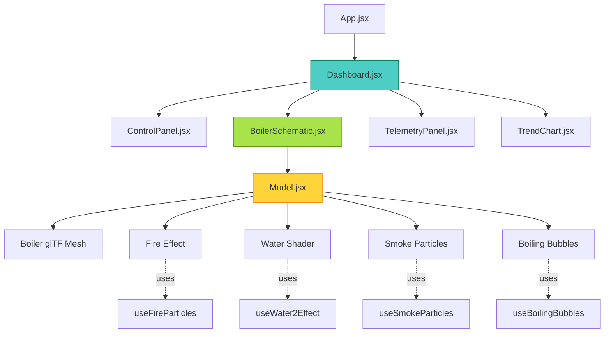
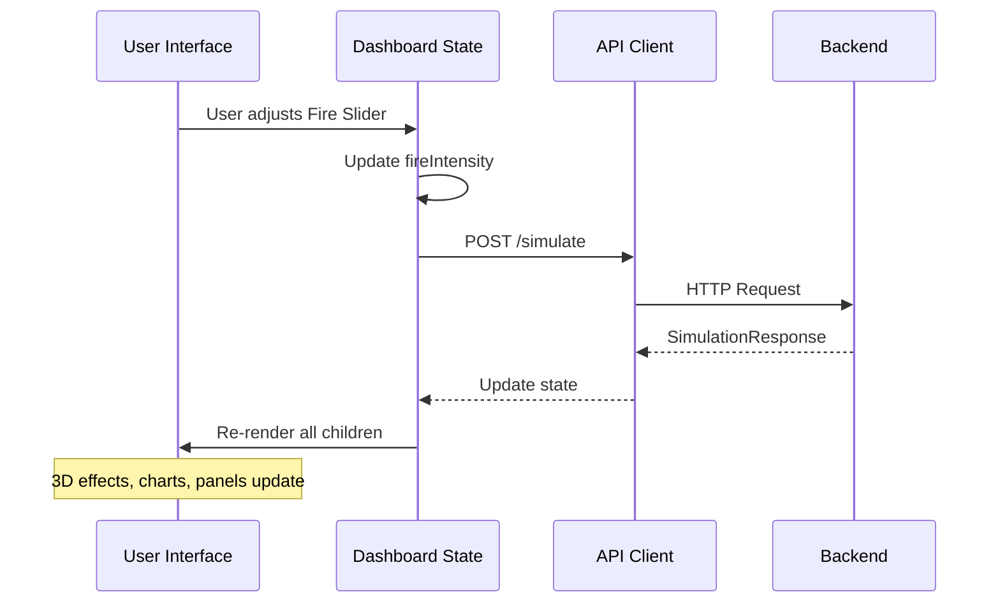
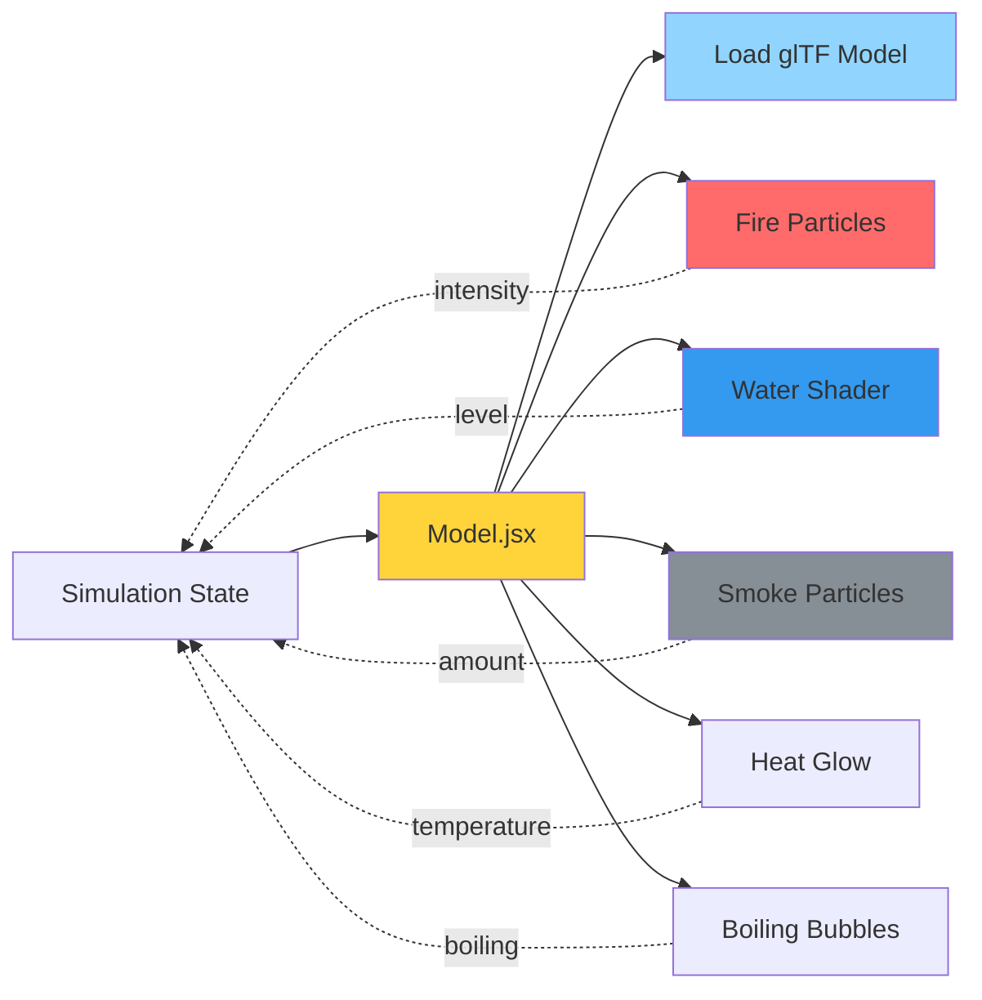
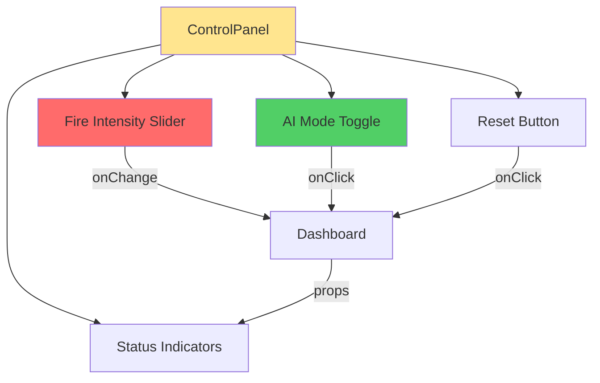
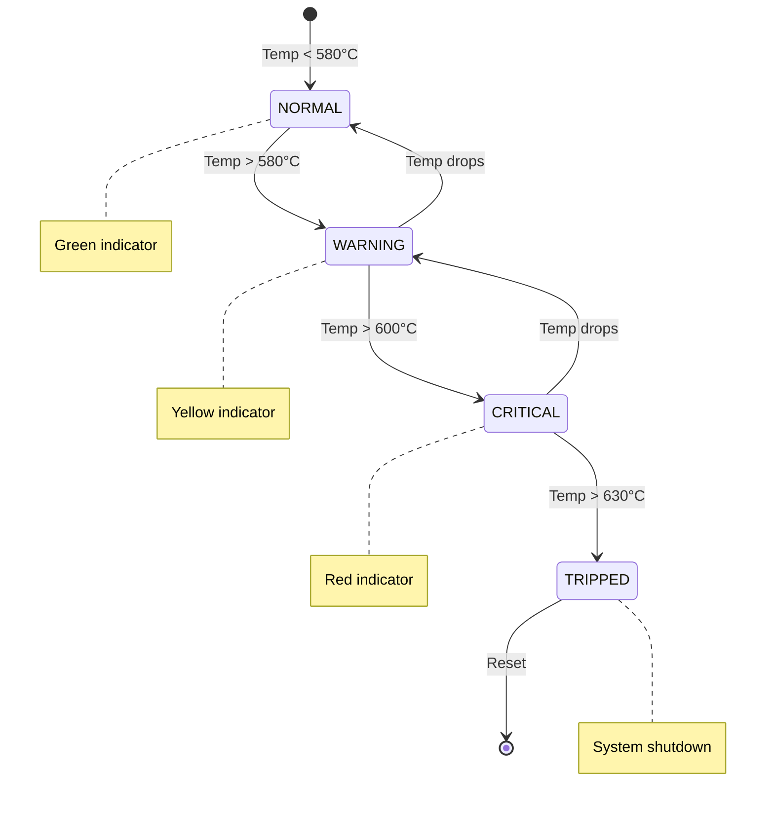
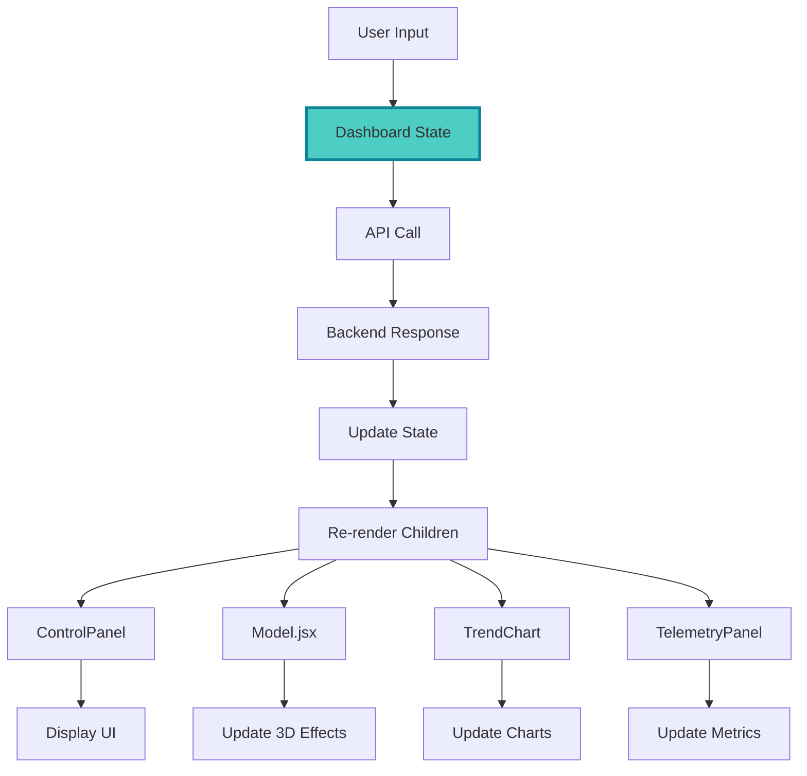
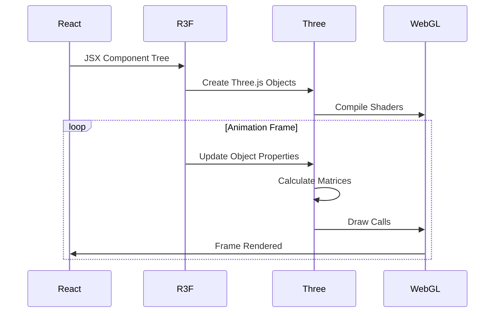

# Frontend Architecture

## Overview

The B.I.M.C.S frontend is a high-fidelity 3D visualization dashboard built with modern web technologies. It renders a photorealistic digital twin of the industrial boiler and provides an intuitive interface for monitoring and control.

## Technology Stack

### Core Framework
- **React 19**: Latest React with concurrent features
- **Vite**: Lightning-fast build tool with HMR
- **TypeScript**: Type-safe JavaScript development

### 3D Graphics
- **Three.js v0.182**: WebGL 3D engine
- **@react-three/fiber v9.5**: React renderer for Three.js
- **@react-three/drei v10.7**: Useful helpers for R3F

### Styling & UI
- **Tailwind CSS v4**: Utility-first CSS framework
- **Lucide React**: Beautiful icon library
- **GSAP**: Advanced animation library

### Data Visualization
- **Recharts v3.6**: React charting library

### Networking
- **Axios v1.13**: Promise-based HTTP client

## Project Structure

```
frontend/
├── src/
│   ├── components/
│   │   ├── Dashboard.jsx          # Main state manager
│   │   ├── BoilerSchematic.jsx    # 3D scene wrapper
│   │   ├── Model.jsx               # 3D boiler model
│   │   ├── ControlPanel.jsx        # User input controls
│   │   ├── TelemetryPanel.jsx      # Data display
│   │   ├── TrendChart.jsx          # Temperature charts
│   │   ├── useFireParticles.js     # Fire effect hook
│   │   ├── useSmokeParticles.js    # Smoke effect hook
│   │   ├── useWater2Effect.js      # Water shader hook
│   │   ├── useLavaEffect.js        # Lava/heat effect hook
│   │   └── useBoilingBubbles.js    # Bubble effect hook
│   ├── App.jsx                     # Root component
│   ├── main.jsx                    # Entry point
│   ├── index.css                   # Global styles
│   └── style.css                   # Additional styles
├── public/                         # Static assets
├── index.html                      # HTML template
├── vite.config.js                  # Vite configuration
├── tsconfig.json                   # TypeScript config
└── package.json                    # Dependencies

```

## Component Architecture

### Component Hierarchy



## Core Components

### 1. Dashboard.jsx

**Responsibility**: Central state manager and orchestrator

```jsx
// Key State Variables
const [fireIntensity, setFireIntensity] = useState(30);
const [aiModeEnabled, setAiModeEnabled] = useState(false);
const [simulationState, setSimulationState] = useState({...});
const [aiData, setAiData] = useState({...});
const [systemStatus, setSystemStatus] = useState('NORMAL');
```

**Data Flow Diagram**:



**Key Functions**:

| Function | Purpose | Triggers |
|----------|---------|----------|
| `runSimulation()` | Sends current inputs to backend | Every 1 second (auto) or user change |
| `handleFireChange()` | Updates fire slider state | User input with debounce |
| `handleAIModeToggle()` | Enables/disables AI supervisor | Toggle switch |
| `handleReset()` | Resets simulation to initial state | Reset button |
| `playAlertSound()` | Audio feedback for critical alerts | System status change |

**Lifecycle**:
```javascript
useEffect(() => {
  // Auto-simulation loop
  const interval = setInterval(runSimulation, 1000);
  return () => clearInterval(interval);
}, [fireIntensity, aiModeEnabled]);
```

### 2. Model.jsx

**Responsibility**: 3D scene rendering and visual effects

**Visual Effects Pipeline**:



**Key Features**:

1. **glTF Model Loading**:
```jsx
const { scene } = useGLTF('/model.glb');
```

2. **Dynamic Material Modifications**:
```javascript
// Fire intensity mapping
const fireScale = fireIntensity / 100;
fireRef.current.scale.set(1, 1 + fireScale, 1);

// Water level animation
waterRef.current.position.y = -1 + (waterLevel / 100) * 2;
```

3. **Custom Shaders**:
- Water surface with waves and reflections
- Fire glow with emissive materials
- Heat distortion effects

### 3. ControlPanel.jsx

**Responsibility**: User input interface



**Input Handling**:
```jsx
<input
  type="range"
  min="0"
  max="100"
  value={fireIntensity}
  onChange={(e) => onFireChange(parseFloat(e.target.value))}
  className="slider"
/>
```

**AI Mode Indicator**:
```jsx
{aiModeEnabled && (
  <div className="ai-active-badge">
    <Shield className="icon" />
    AI Supervisor Active
  </div>
)}
```

### 4. TelemetryPanel.jsx

**Responsibility**: Real-time data display

**Metrics Displayed**:
- Current Temperature (°C)
- System Pressure (MPa)
- Water Level (%)
- Fire Intensity (%)
- Steam Generation Rate
- AI Prediction Status

**Visual Indicators**:


### 5. TrendChart.jsx

**Responsibility**: Temperature history visualization

**Features**:
- Dual-line chart (Actual vs Predicted)
- Real-time updates
- Scrolling window (last 30 data points)
- Color-coded by status

```jsx
<LineChart data={chartHistory}>
  <Line 
    dataKey="actual" 
    stroke="#ff6b6b" 
    name="Actual Temp"
  />
  <Line 
    dataKey="predicted" 
    stroke="#4ecdc4" 
    name="AI Prediction"
    strokeDasharray="5 5"
  />
</LineChart>
```

## Custom Hooks

### useFireParticles.js

**Purpose**: Create realistic fire particle system

```javascript
// Particle system configuration
const particleCount = Math.floor(fireIntensity * 2);
const particles = useMemo(() => {
  const positions = new Float32Array(particleCount * 3);
  // Generate random positions in flame shape
  for (let i = 0; i < particleCount; i++) {
    positions[i * 3] = Math.random() - 0.5;
    positions[i * 3 + 1] = Math.random() * 2;
    positions[i * 3 + 2] = Math.random() - 0.5;
  }
  return positions;
}, [fireIntensity]);
```

**Animation**:
- Upward motion with turbulence
- Color gradient (yellow → orange → red)
- Size variation based on lifetime
- Heat distortion effect

### useSmokeParticles.js

**Purpose**: Smoke emission from chimney

```javascript
// Smoke generation rate
const smokeRate = fireIntensity / 100;
const particleOpacity = 0.3 * smokeRate;

// Upward drift with dissipation
useFrame((state, delta) => {
  particles.forEach(p => {
    p.position.y += delta * 2;
    p.opacity -= delta * 0.1;
    if (p.opacity <= 0) resetParticle(p);
  });
});
```

### useWater2Effect.js

**Purpose**: Realistic water surface shader

**Shader Features**:
- Wave animation
- Reflection mapping
- Refraction distortion
- Foam at edges

```glsl
// Vertex shader (simplified)
varying vec2 vUv;
void main() {
  vUv = uv;
  vec3 pos = position;
  pos.y += sin(pos.x * 5.0 + time) * 0.05;
  gl_Position = projectionMatrix * modelViewMatrix * vec4(pos, 1.0);
}

// Fragment shader
uniform float waterLevel;
void main() {
  vec3 waterColor = vec3(0.2, 0.4, 0.8);
  gl_FragColor = vec4(waterColor, 0.8);
}
```

## State Management Pattern

### Unidirectional Data Flow



### Props Drilling

```javascript
// Dashboard.jsx
<ControlPanel
  fireIntensity={fireIntensity}
  onFireChange={handleFireChange}
  aiModeEnabled={aiModeEnabled}
  onAIModeToggle={handleAIModeToggle}
  systemStatus={systemStatus}
/>

<Model
  fireIntensity={simulationState.fire_intensity}
  waterLevel={simulationState.water_level}
  pressure={simulationState.pressure}
  temperature={simulationState.temperature}
/>

<TrendChart
  history={chartHistory}
  predictedTemps={aiData.predicted_temps_series}
/>
```

## 3D Rendering Pipeline

### React Three Fiber Setup

```jsx
<Canvas
  camera={{ position: [5, 3, 5], fov: 50 }}
  shadows
  gl={{ antialias: true }}
>
  {/* Lighting */}
  <ambientLight intensity={0.5} />
  <directionalLight position={[10, 10, 5]} intensity={1} castShadow />
  
  {/* Environment */}
  <Environment preset="warehouse" />
  
  {/* Camera Controls */}
  <OrbitControls 
    enableZoom={true}
    maxDistance={15}
    minDistance={3}
  />
  
  {/* Scene Content */}
  <Model {...props} />
  
  {/* Effects */}
  <EffectComposer>
    <Bloom intensity={0.5} />
  </EffectComposer>
</Canvas>
```

### Rendering Flow



## Performance Optimizations

### 1. Memoization

```javascript
// Expensive calculations
const particleGeometry = useMemo(() => {
  return new THREE.BufferGeometry();
}, []);

// Component memoization
const MemoizedModel = memo(Model);
```

### 2. Debouncing User Input

```javascript
const handleFireChange = (value) => {
  if (debounceTimer) clearTimeout(debounceTimer);
  
  setDebounceTimer(
    setTimeout(() => {
      setFireIntensity(value);
    }, 300)
  );
};
```

### 3. Conditional Rendering

```javascript
{systemStatus === 'CRITICAL' && (
  <AlertBanner message="CRITICAL: Temperature exceeding safe limits!" />
)}
```

### 4. useFrame Optimization

```javascript
useFrame((state, delta) => {
  // Limit updates to essential calculations
  if (delta < 0.1) {
    // Update logic only if frame time is reasonable
  }
});
```

## Responsive Design

### Breakpoint Strategy

| Screen Size | Layout | 3D View | Controls |
|-------------|--------|---------|----------|
| < 768px | Single column | Full width | Below scene |
| 768px - 1024px | Two column | 60% width | Side panel |
| > 1024px | Grid layout | 70% width | Side panel + bottom telemetry |

### CSS Approach

```css
/* Tailwind responsive classes */
<div className="
  grid 
  grid-cols-1 
  md:grid-cols-2 
  lg:grid-cols-3 
  gap-4
">
```

## Error Handling

### API Error Boundaries

```javascript
try {
  const response = await axios.post('/simulate', data);
  setSimulationState(response.data.visual_state);
  setError(null);
} catch (err) {
  setError('Failed to communicate with backend');
  console.error('Simulation error:', err);
}
```

### Visual Error Feedback

```jsx
{error && (
  <div className="error-banner">
    <AlertCircle className="icon" />
    {error}
  </div>
)}
```

## Testing Strategy (Future)

### Recommended Tests

1. **Component Tests**:
   - Dashboard state updates correctly
   - ControlPanel inputs trigger callbacks
   - TrendChart renders with data

2. **Integration Tests**:
   - API communication flow
   - State synchronization across components

3. **Visual Regression Tests**:
   - 3D scene renders correctly
   - UI layout at different breakpoints

4. **Performance Tests**:
   - Frame rate during heavy particle effects
   - Memory usage over extended sessions

---

Next: [Backend Architecture →](backend.md)
