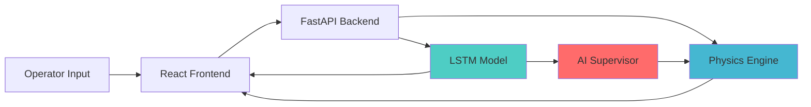

# B.I.M.C.S - Boiler Intelligent Monitoring & Control System

!!! abstract "Project Vision"
    **B.I.M.C.S** is a cutting-edge Industrial Digital Twin application that transforms boiler operations through real-time 3D visualization and AI-powered predictive control. This early-stage project combines high-fidelity physics simulation with advanced machine learning to ensure safe and efficient industrial steam boiler operation.

## Overview

B.I.M.C.S serves as a **Digital Twin** for industrial operators, training simulations, and predictive maintenance. It addresses the critical challenge of boiler steam temperature control where thermal response delays can lead to dangerous pressure build-ups or inefficient steam generation.

### Current Status

🚧 **Early Development Stage** - Core functionality implemented, expanding towards production-ready industrial deployment.

## Key Capabilities

### 🎨 3D Digital Twin Visualization
Real-time interactive 3D model of the drum boiler featuring:

- Dynamic water level visualization
- Fire intensity simulation
- Steam generation effects
- Smoke emission rendering
- Photorealistic material shaders

### 🤖 AI Predictive Supervisor
LSTM-based neural network providing:

- **30-second ahead temperature prediction**
- Real-time anomaly detection
- Proactive safety interventions
- Clamping of dangerous control inputs

### ⚡ Real-Time Physics Engine
Custom Python-based drum boiler simulation:

- Water level dynamics
- Pressure calculation
- Heat transfer modeling
- Thermal inertia effects

### 📊 Live Telemetry Dashboard
Comprehensive monitoring interface:

- Temperature trend graphing
- AI prediction vs actual comparison
- System status indicators
- Alert management

## Problem Statement

Industrial steam boilers face critical safety challenges:

1. **Thermal Lag**: Fire intensity changes affect steam temperature with significant delay
2. **Pressure Risks**: Uncontrolled heating can cause dangerous pressure spikes
3. **Operator Training**: New operators need safe simulation environments
4. **Predictive Maintenance**: Early detection of abnormal conditions prevents failures

B.I.M.C.S solves these by creating a **predictive digital twin** that sees future states before they occur.

## Architecture Highlights



The system follows a **Hybrid Digital Twin** architecture combining:

- **Deterministic Physics**: Grounded in thermodynamic laws
- **Probabilistic AI**: Learns patterns from historical data
- **Intelligent Control**: AI intervenes to prevent predicted failures

## Technology Stack

### Frontend
- **React 19** with Vite for fast development
- **Three.js** & React Three Fiber for 3D rendering
- **Tailwind CSS v4** for futuristic UI design
- **Recharts** for telemetry visualization

### Backend
- **FastAPI** for high-performance REST API
- **TensorFlow/Keras** for LSTM model inference
- **NumPy** for physics calculations
- Custom physics engine in Python

### DevOps
- Cross-platform support (Windows, Linux, macOS)
- Simple installation with npm and pip
- Hot-reload development environment

## Quick Start

### Prerequisites
```bash
Node.js v18+ 
Python 3.9+
```

### Backend Setup
```bash
cd backend
python -m venv .venv
source .venv/bin/activate  # Windows: .venv\Scripts\activate
pip install -r requirements.txt
python main.py
```

Backend runs on `http://localhost:8000`

### Frontend Setup
```bash
cd frontend
npm install
npm run dev
```

Frontend runs on `http://localhost:5173`

## Usage

1. **Fire Intensity Control**: Adjust slider (0-100%) to control furnace heat
2. **AI Supervisor Mode**: Enable automatic safety interventions
3. **Monitor Telemetry**: Watch real-time temperature, pressure, and predictions
4. **Visual Feedback**: Observe water level, fire intensity, and smoke in 3D

!!! warning "AI Intervention"
    When AI Supervisor mode is enabled and dangerous conditions are predicted, the system will automatically clamp fire intensity to safe levels, overriding user input to prevent accidents.

## Documentation Structure

- **[Architecture](architecture.md)**: System design and component interactions
- **[Frontend](frontend.md)**: React and Three.js implementation details
- **[Backend](backend.md)**: FastAPI, physics engine, and AI components
- **[API Reference](api-reference.md)**: Endpoint documentation and schemas
- **[3D Model](3d-model.md)**: Boiler model structure and visual effects
- **[ML Training](ml-training.md)**: LSTM model architecture and training approach
- **[Development](development.md)**: Setup, contribution guidelines, and workflows

## Future Roadmap

- [ ] Multi-boiler fleet management
- [ ] Historical data replay and analysis
- [ ] Advanced control strategies (PID, MPC)
- [ ] Mobile responsive interface
- [ ] Docker containerization
- [ ] Cloud deployment with real sensor integration
- [ ] Extended predictive capabilities (maintenance, efficiency)

## License

This project is currently in early development. License to be determined.

## Contributors

Built with passion for industrial safety and innovation.

---

**Version**: Early Development  
**Last Updated**: February 2026
