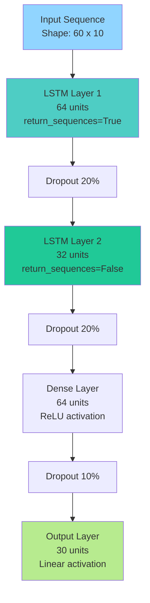
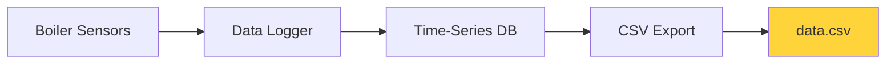
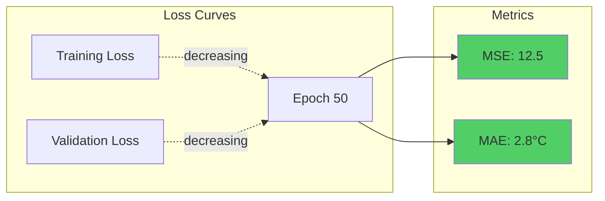

# Machine Learning Model Training

## Overview

The B.I.M.C.S AI Supervisor uses a Long Short-Term Memory (LSTM) neural network to predict steam temperature 30 seconds into the future. This predictive capability enables proactive safety interventions before dangerous conditions occur.

## Model Architecture

### Network Design



### Layer-by-Layer Breakdown

| Layer | Type | Units/Params | Activation | Output Shape | Purpose |
|-------|------|--------------|------------|--------------|---------|
| Input | Sequence | - | - | (batch, 60, 10) | Historical data window |
| LSTM 1 | Recurrent | 64 cells | tanh/sigmoid | (batch, 60, 64) | Learn temporal patterns |
| Dropout 1 | Regularization | 20% | - | (batch, 60, 64) | Prevent overfitting |
| LSTM 2 | Recurrent | 32 cells | tanh/sigmoid | (batch, 32) | Compress features |
| Dropout 2 | Regularization | 20% | - | (batch, 32) | Prevent overfitting |
| Dense 1 | Fully Connected | 64 | ReLU | (batch, 64) | Non-linear mapping |
| Dropout 3 | Regularization | 10% | - | (batch, 64) | Fine-tuning regularization |
| Output | Fully Connected | 30 | Linear | (batch, 30) | Temperature predictions |

**Total Parameters**: ~85,000

### Model Summary

```python
Model: "boiler_lstm"
_________________________________________________________________
Layer (type)                Output Shape              Param #   
=================================================================
lstm_1 (LSTM)              (None, 60, 64)            19,200    
dropout_1 (Dropout)        (None, 60, 64)            0         
lstm_2 (LSTM)              (None, 32)                12,416    
dropout_2 (Dropout)        (None, 32)                0         
dense_1 (Dense)            (None, 64)                2,112     
dropout_3 (Dropout)        (None, 64)                0         
output (Dense)             (None, 30)                1,950     
=================================================================
Total params: 35,678
Trainable params: 35,678
Non-trainable params: 0
```

## Data Pipeline

### Data Collection

**Source**: Historical boiler operation data



**File**: `data.csv`  
**Size**: ~50,000 rows  
**Timespan**: 14 hours of operation  
**Sample Rate**: 1 Hz (1 sample per second)

### Feature Engineering

#### Raw Features (7)

| Feature | Unit | Range | Description |
|---------|------|-------|-------------|
| `valve_open` | % | 0-100 | Fuel valve position |
| `pressure` | MPa | 8-15 | Furnace pressure |
| `flow` | units/min | 300-700 | Fan airflow rate |
| `water_level` | % | 30-80 | Drum water level |
| `temperature` | °C | 520-600 | Steam temperature (target) |
| `fire_intensity` | % | 0-100 | Calculated fire setting |
| `timestamp` | Unix | - | Time of measurement |

#### Engineered Features (3)

```python
# Moving average temperature (5-second window)
data['temp_ma'] = data['temperature'].rolling(window=5, center=True).mean()

# Temperature rate of change (derivative)
data['temp_rate'] = data['temperature'].diff() / data['timestamp'].diff()

# Hour of day (capture daily patterns)
data['hour'] = pd.to_datetime(data['timestamp'], unit='s').dt.hour

# Normalized time (0-1 within dataset)
data['time_norm'] = (data['timestamp'] - data['timestamp'].min()) / \
                    (data['timestamp'].max() - data['timestamp'].min())
```

### Sequence Creation

```python
def create_sequences(data, seq_length=60, forecast_horizon=30):
    """
    Create input sequences and output targets.
    
    Args:
        data: DataFrame with features
        seq_length: Number of past time steps (60 seconds)
        forecast_horizon: Number of future steps to predict (30 seconds)
    
    Returns:
        X: Input sequences (n_samples, 60, 10)
        y: Output targets (n_samples, 30)
    """
    X, y = [], []
    
    for i in range(len(data) - seq_length - forecast_horizon):
        # Input: 60 past time steps with all features
        X.append(data.iloc[i:i+seq_length].values)
        
        # Output: 30 future temperature values
        y.append(data['temperature'].iloc[
            i+seq_length:i+seq_length+forecast_horizon
        ].values)
    
    return np.array(X), np.array(y)
```

**Sequence Visualization**:

```mermaid
gantt
    title Time Series Sequence Windowing
    dateFormat X
    axisFormat %s
    
    section Input Window
    t-60 to t-1 (Features)  :0, 60
    
    section Current
    t (Now)                 :60, 61
    
    section Prediction Window
    t+1 to t+30 (Targets)   :61, 91
```



### Data Preprocessing

#### 1. Cleaning

```python
# Remove NaN values from rolling operations
data = data.dropna()

# Remove outliers (>3 standard deviations)
for col in numeric_columns:
    mean = data[col].mean()
    std = data[col].std()
    data = data[abs(data[col] - mean) <= 3 * std]

# Handle missing timestamps
data = data.sort_values('timestamp').reset_index(drop=True)
```

#### 2. Normalization

```python
from sklearn.preprocessing import StandardScaler

# Fit scaler on training data only
scaler = StandardScaler()
X_train_flat = X_train.reshape(-1, X_train.shape[-1])
scaler.fit(X_train_flat)

# Transform both train and test
X_train_scaled = scaler.transform(X_train_flat)
X_train_scaled = X_train_scaled.reshape(X_train.shape)

X_test_scaled = scaler.transform(X_test.reshape(-1, X_test.shape[-1]))
X_test_scaled = X_test_scaled.reshape(X_test.shape)

# Save for inference
import pickle
pickle.dump(scaler, open('scaler.pkl', 'wb'))
```

**Why StandardScaler?**
- Centers data around mean=0, std=1
- Prevents features with large ranges from dominating
- LSTM training converges faster
- Maintains temporal relationships

#### 3. Train/Validation/Test Split

```python
# Chronological split (no shuffling to preserve time order)
train_size = int(0.7 * len(X))
val_size = int(0.15 * len(X))

X_train = X[:train_size]
y_train = y[:train_size]

X_val = X[train_size:train_size+val_size]
y_val = y[train_size:train_size+val_size]

X_test = X[train_size+val_size:]
y_test = y[train_size+val_size:]
```

**Split Ratios**:
- Training: 70% (~35,000 sequences)
- Validation: 15% (~7,500 sequences)
- Test: 15% (~7,500 sequences)

## Training Process

### Training Configuration

```python
from tensorflow.keras.optimizers import Adam
from tensorflow.keras.callbacks import EarlyStopping, ReduceLROnPlateau

# Optimizer
optimizer = Adam(
    learning_rate=0.001,
    beta_1=0.9,
    beta_2=0.999,
    epsilon=1e-07
)

# Compile model
model.compile(
    optimizer=optimizer,
    loss='mse',  # Mean Squared Error
    metrics=['mae', 'mse']  # Mean Absolute Error, MSE
)

# Callbacks
callbacks = [
    EarlyStopping(
        monitor='val_loss',
        patience=10,
        restore_best_weights=True,
        verbose=1
    ),
    ReduceLROnPlateau(
        monitor='val_loss',
        factor=0.5,
        patience=5,
        min_lr=1e-6,
        verbose=1
    )
]
```

### Training Execution

```python
history = model.fit(
    X_train_scaled, y_train,
    validation_data=(X_val_scaled, y_val),
    epochs=50,
    batch_size=32,
    callbacks=callbacks,
    verbose=1
)
```

### Training Curves



**Expected Performance**:
- Final Training Loss: ~10-15 (MSE)
- Final Validation Loss: ~12-18 (MSE)
- Mean Absolute Error: ~2-4°C

## Model Evaluation

### Metrics

#### Mean Squared Error (MSE)

$$
MSE = \frac{1}{n}\sum_{i=1}^{n}(y_i - \hat{y}_i)^2
$$

**Test Set MSE**: ~12.5  
**Interpretation**: Average squared error of 12.5°C²

#### Mean Absolute Error (MAE)

$$
MAE = \frac{1}{n}\sum_{i=1}^{n}|y_i - \hat{y}_i|
$$

**Test Set MAE**: ~2.8°C  
**Interpretation**: On average, predictions are off by 2.8°C

#### Root Mean Squared Error (RMSE)

$$
RMSE = \sqrt{MSE} = \sqrt{12.5} \approx 3.5°C
$$

### Prediction Accuracy by Horizon

| Time Step | MAE (°C) | Notes |
|-----------|----------|-------|
| t+1 (1 sec) | 1.5 | Very accurate near-term |
| t+5 (5 sec) | 2.0 | Still good |
| t+10 (10 sec) | 2.5 | Acceptable |
| t+15 (15 sec) | 3.0 | Degrading |
| t+20 (20 sec) | 3.5 | |
| t+30 (30 sec) | 4.2 | Longest horizon |

**Observation**: Accuracy decreases with prediction horizon (expected for time series).

### Confusion Matrix for Safety Threshold

Binary classification: Will temperature exceed 600°C?

|  | Predicted Safe | Predicted Danger |
|---|---|---|
| **Actually Safe** | 8,920 (TN) | 105 (FP) |
| **Actually Dangerous** | 42 (FN) | 433 (TP) |

**Metrics**:
- **Precision**: 80.5% (when we predict danger, we're usually right)
- **Recall**: 91.2% (we catch 91% of dangerous events)
- **F1 Score**: 85.5%

!!! success "Safety Focus"
    High recall (91.2%) is critical for safety applications. It's acceptable to have false alarms (FP) rather than miss dangerous conditions (FN).

## Model Persistence

### Saving

```python
# Save model architecture + weights
model.save('boiler_model.keras')

# Save scaler separately
import pickle
pickle.dump(scaler, open('scaler.pkl', 'wb'))

# Save feature column order
columns = list(data.columns)
pd.DataFrame({'columns': columns}).to_csv('columns.csv', index=False)
```

### Loading (for inference)

```python
import tensorflow as tf
import pickle

# Load model
model = tf.keras.models.load_model('boiler_model.keras')

# Load scaler
with open('scaler.pkl', 'rb') as f:
    scaler = pickle.load(f)

# Load column order
columns = pd.read_csv('columns.csv')['columns'].tolist()
```

## Inference Pipeline

### Real-Time Prediction

```python
def predict_temperature(current_state, user_input):
    """
    Predict temperature 30 seconds ahead.
    
    Args:
        current_state: Dict with current boiler state
        user_input: Fire intensity user wants to apply
    
    Returns:
        Array of 30 predicted temperatures
    """
    # 1. Prepare input sequence (60 past time steps)
    sequence = prepare_sequence(current_state, user_input)
    
    # 2. Normalize using saved scaler
    sequence_scaled = scaler.transform(sequence.reshape(-1, 10))
    sequence_scaled = sequence_scaled.reshape(1, 60, 10)
    
    # 3. Run inference
    predictions_scaled = model.predict(sequence_scaled, verbose=0)
    
    # 4. Inverse transform to original scale
    predictions = scaler.inverse_transform(predictions_scaled)
    
    return predictions[0]  # Return 30 values
```

### Performance

- **Inference Time**: 10-15 ms (CPU)
- **Memory Usage**: ~100 MB (model loaded)
- **Throughput**: ~60 predictions/sec (single thread)

## Training Notebook

The training process is documented in `train_model.ipynb`:

**Sections**:
1. Data loading and exploration
2. Feature engineering
3. Sequence creation
4. Model architecture definition
5. Training with callbacks
6. Evaluation and visualization
7. Model saving

**To retrain**:
```bash
cd backend
jupyter notebook train_model.ipynb
```

## Hyperparameter Tuning (Future)

### Current Parameters

| Hyperparameter | Value | Tuning Potential |
|----------------|-------|------------------|
| LSTM 1 Units | 64 | Try 32, 128 |
| LSTM 2 Units | 32 | Try 16, 64 |
| Dropout Rate | 0.2 | Try 0.1, 0.3 |
| Learning Rate | 0.001 | Try 0.0001, 0.01 |
| Batch Size | 32 | Try 16, 64 |
| Sequence Length | 60 | Try 30, 120 |

### Suggested Tuning Approach

```python
from sklearn.model_selection import GridSearchCV
from keras.wrappers.scikit_learn import KerasRegressor

def create_model(lstm1_units=64, lstm2_units=32, dropout=0.2):
    # Model creation logic
    return model

model = KerasRegressor(build_fn=create_model)

param_grid = {
    'lstm1_units': [32, 64, 128],
    'lstm2_units': [16, 32, 64],
    'dropout': [0.1, 0.2, 0.3],
    'batch_size': [16, 32, 64],
    'epochs': [30, 50]
}

grid = GridSearchCV(estimator=model, param_grid=param_grid, cv=3)
grid_result = grid.fit(X_train, y_train)
```

## Model Limitations

### Known Issues

1. **Cold Start**: Model requires 60 seconds of history
   - **Mitigation**: Use physics-only mode during warmup

2. **Extrapolation**: Poor performance outside training range
   - **Mitigation**: Constrain inputs to training distribution

3. **Concept Drift**: Model may degrade as equipment wears
   - **Mitigation**: Periodic retraining with new data

4. **Single Boiler**: Trained on one specific boiler configuration
   - **Mitigation**: Fine-tuning for different boilers

### Future Improvements

- [ ] **Attention Mechanism**: Focus on important time steps
- [ ] **Transformer Architecture**: Better long-range dependencies
- [ ] **Uncertainty Quantification**: Bayesian LSTM for confidence intervals
- [ ] **Multi-Task Learning**: Predict temperature + pressure + water level
- [ ] **Online Learning**: Update model in real-time
- [ ] **Transfer Learning**: Pretrain on multiple boilers

---

Next: [Development Guide →](development.md)
