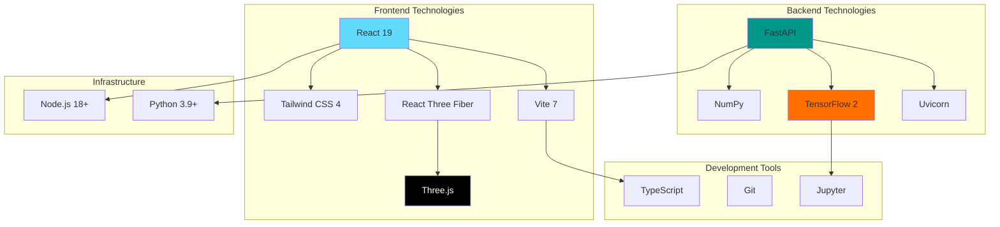

# Technology Stack

## Overview

B.I.M.C.S leverages modern, production-grade technologies across its entire stack to deliver a high-performance industrial digital twin application.

## Stack Diagram



## Frontend Stack

### Core Framework

#### React 19
**Purpose**: UI Component Library  
**Version**: 19.2.3  
**Why Chosen**:
- Latest concurrent features for smooth rendering
- Best-in-class component model
- Huge ecosystem of libraries
- Excellent TypeScript support

**Key Features Used**:
- Hooks (useState, useEffect, useCallback, useMemo)
- Functional components
- Concurrent rendering for 3D performance

**Official Site**: [react.dev](https://react.dev)

---

#### Vite 7
**Purpose**: Build Tool & Dev Server  
**Version**: 7.2.4  
**Why Chosen**:
- Lightning-fast Hot Module Replacement (HMR)
- Native ES modules (no bundling in dev)
- Optimized production builds
- Built-in TypeScript support

**Configuration**:
```javascript
// vite.config.js
export default {
  plugins: [react()],
  server: {
    port: 5173,
    proxy: {
      '/api': 'http://localhost:8000'
    }
  }
}
```

**Official Site**: [vitejs.dev](https://vitejs.dev)

---

### 3D Graphics

#### Three.js
**Purpose**: WebGL 3D Engine  
**Version**: 0.182.0  
**Why Chosen**:
- Industry standard for web 3D
- Comprehensive API for rendering, geometries, materials
- Active development and community
- Excellent documentation

**Features Used**:
- PerspectiveCamera
- WebGLRenderer with shadows
- BufferGeometry for efficiency
- ShaderMaterial for custom effects
- GLTFLoader for model import

**Official Site**: [threejs.org](https://threejs.org)

---

#### @react-three/fiber
**Purpose**: React Renderer for Three.js  
**Version**: 9.5.0  
**Why Chosen**:
- Declarative Three.js in React
- Automatic memory management
- React-friendly API
- Hooks for animation (useFrame)

**Example**:
```jsx
<Canvas>
  <mesh>
    <boxGeometry args={[1, 1, 1]} />
    <meshStandardMaterial color="orange" />
  </mesh>
</Canvas>
```

**Official Site**: [docs.pmnd.rs/react-three-fiber](https://docs.pmnd.rs/react-three-fiber)

---

#### @react-three/drei
**Purpose**: Helper Library for R3F  
**Version**: 10.7.7  
**Why Chosen**:
- Pre-built useful components
- OrbitControls, Environment, useGLTF
- Saves development time

**Features Used**:
- `useGLTF` - Model loading
- `OrbitControls` - Camera navigation
- `Environment` - HDR lighting
- `Html` - 3D-positioned HTML elements

**Official Site**: [github.com/pmndrs/drei](https://github.com/pmndrs/drei)

---

### Styling

#### Tailwind CSS 4
**Purpose**: Utility-First CSS Framework  
**Version**: 4.1.18  
**Why Chosen**:
- Rapid UI development
- Consistent design system
- Minimal CSS bundle size
- Dark mode support

**Configuration**:
```javascript
// tailwind.config.js
export default {
  content: ['./src/**/*.{js,jsx,ts,tsx}'],
  theme: {
    extend: {
      colors: {
        primary: '#4ecdc4',
        danger: '#ff6b6b'
      }
    }
  }
}
```

**Official Site**: [tailwindcss.com](https://tailwindcss.com)

---

### Additional Frontend Libraries

#### Axios
**Purpose**: HTTP Client  
**Version**: 1.13.2  
**Why**: Promise-based, better than fetch API

```javascript
import axios from 'axios';

const response = await axios.post('/simulate', data);
```

---

#### Recharts
**Purpose**: Charting Library  
**Version**: 3.6.0  
**Why**: React-native charts, easy to use

```jsx
<LineChart data={chartHistory}>
  <Line dataKey="temperature" stroke="#ff6b6b" />
</LineChart>
```

---

#### GSAP
**Purpose**: Animation Library  
**Version**: 3.14.2  
**Why**: Smooth, professional animations

```javascript
gsap.to(element, { opacity: 1, duration: 0.5 });
```

---

#### Lucide React
**Purpose**: Icon Library  
**Version**: 0.562.0  
**Why**: Beautiful, consistent icons

```jsx
import { Flame, Thermometer } from 'lucide-react';
<Flame className="icon" />
```

---

## Backend Stack

### Core Framework

#### FastAPI
**Purpose**: Modern Python Web Framework  
**Version**: Latest  
**Why Chosen**:
- High performance (matches Node.js/Go)
- Automatic API documentation (OpenAPI/Swagger)
- Pydantic data validation
- Async support
- Type hints

**Key Features**:
```python
from fastapi import FastAPI
from pydantic import BaseModel

app = FastAPI()

class Request(BaseModel):
    value: float

@app.post("/endpoint")
async def endpoint(request: Request):
    return {"result": request.value * 2}
```

**Official Site**: [fastapi.tiangolo.com](https://fastapi.tiangolo.com)

---

#### Uvicorn
**Purpose**: ASGI Server  
**Version**: Latest  
**Why Chosen**:
- Lightning-fast async server
- Default for FastAPI
- Production-ready

**Usage**:
```bash
uvicorn main:app --host 0.0.0.0 --port 8000
```

**Official Site**: [uvicorn.org](https://www.uvicorn.org)

---

### Machine Learning

#### TensorFlow 2.x
**Purpose**: Deep Learning Framework  
**Version**: 2.x  
**Why Chosen**:
- Production-ready ML platform
- Keras API (high-level)
- CPU and GPU support
- Model serving capabilities

**Key Features Used**:
- LSTM layers
- Model training and inference
- Model persistence (.keras format)

**Official Site**: [tensorflow.org](https://www.tensorflow.org)

---

#### Keras
**Purpose**: High-Level Neural Network API  
**Version**: Integrated in TensorFlow 2.x  
**Why Chosen**:
- User-friendly API
- Quick prototyping
- Production deployment

**Model Example**:
```python
model = keras.Sequential([
    keras.layers.LSTM(64, return_sequences=True),
    keras.layers.LSTM(32),
    keras.layers.Dense(30)
])
```

---

#### scikit-learn
**Purpose**: Machine Learning Utilities  
**Version**: Latest  
**Why Chosen**:
- StandardScaler for data normalization
- Train/test splitting
- Evaluation metrics

**Usage**:
```python
from sklearn.preprocessing import StandardScaler
scaler = StandardScaler()
X_scaled = scaler.fit_transform(X)
```

**Official Site**: [scikit-learn.org](https://scikit-learn.org)

---

### Scientific Computing

#### NumPy
**Purpose**: Numerical Computing  
**Version**: Latest  
**Why Chosen**:
- Fast array operations
- Physics calculations
- Required by TensorFlow

```python
import numpy as np
result = np.mean(array)
```

**Official Site**: [numpy.org](https://numpy.org)

---

#### Pandas
**Purpose**: Data Manipulation  
**Version**: Latest  
**Why Chosen**:
- CSV data loading
- Time series operations
- Feature engineering

```python
import pandas as pd
data = pd.read_csv('data.csv')
```

**Official Site**: [pandas.pydata.org](https://pandas.pydata.org)

---

## Development Tools

### TypeScript
**Purpose**: Type-Safe JavaScript  
**Version**: 5.9.3  
**Why Chosen**:
- Catch errors at compile time
- Better IDE support
- Self-documenting code

**Configuration**:
```json
{
  "compilerOptions": {
    "target": "ES2020",
    "jsx": "react-jsx",
    "strict": true
  }
}
```

---

### Jupyter Notebook
**Purpose**: Interactive Python Environment  
**Version**: Latest  
**Why Chosen**:
- Model training and experimentation
- Data exploration
- Documentation with code

**Usage**:
```bash
jupyter notebook train_model.ipynb
```

---

### Git
**Purpose**: Version Control  
**Why**: Industry standard, distributed VCS

---

## Infrastructure

### Runtime Environments

| Environment | Version | Purpose |
|-------------|---------|---------|
| **Python** | 3.9 - 3.11 | Backend runtime |
| **Node.js** | 18+ | Frontend build & runtime |
| **npm** | 9+ | JavaScript package manager |
| **pip** | Latest | Python package manager |

---

## Deployment Stack (Future)

### Containerization

#### Docker
**Purpose**: Application containerization

```dockerfile
# Backend Dockerfile
FROM python:3.11-slim
WORKDIR /app
COPY requirements.txt .
RUN pip install -r requirements.txt
COPY . .
CMD ["uvicorn", "main:app", "--host", "0.0.0.0"]
```

---

### Cloud Platforms (Potential)

| Platform | Use Case |
|----------|----------|
| **AWS EC2** | Backend compute |
| **AWS S3** | Model storage |
| **Vercel/Netlify** | Frontend static hosting |
| **Heroku** | Simple full-stack deployment |
| **DigitalOcean** | Cost-effective VPS |

---

### Database (Future)

#### PostgreSQL
**Purpose**: Persistent data storage  
**Use Cases**:
- Historical telemetry
- User accounts
- Simulation sessions

#### Redis
**Purpose**: Caching & real-time data  
**Use Cases**:
- Session state
- Simulation cache
- WebSocket pub/sub

---

## Documentation Stack

### MkDocs
**Purpose**: Documentation Site Generator  
**Version**: Latest  
**Why Chosen**:
- Markdown-based
- Beautiful Material theme
- Easy deployment

**Configuration**:
```yaml
site_name: B.I.M.C.S Documentation
theme:
  name: material
  palette:
    primary: indigo
```

**Official Site**: [mkdocs.org](https://www.mkdocs.org)

---

### Mermaid
**Purpose**: Diagram Generation  
**Why Chosen**:
- Code-based diagrams
- Version control friendly
- Multiple diagram types

**Example**:
````markdown

````

---

## Version Compatibility

### Tested Configurations

| OS | Python | Node.js | Status |
|----|--------|---------|--------|
| Ubuntu 22.04 | 3.11 | 18.x | ✅ |
| macOS 14 | 3.10 | 20.x | ✅ |
| Windows 11 | 3.11 | 18.x | ✅ |

### Minimum Requirements

- **RAM**: 4GB (8GB recommended)
- **CPU**: 2 cores (4 cores recommended)
- **Disk**: 2GB free space
- **GPU**: Not required (CPU inference works)

---

## Package Managers

### Frontend - npm

```json
{
  "dependencies": {
    "react": "^19.2.3",
    "three": "^0.182.0",
    "axios": "^1.13.2"
  },
  "devDependencies": {
    "vite": "^7.2.4",
    "typescript": "~5.9.3"
  }
}
```

### Backend - pip

```txt
fastapi>=0.100.0
uvicorn>=0.23.0
tensorflow>=2.12.0
numpy>=1.24.0
pandas>=2.0.0
scikit-learn>=1.3.0
pydantic>=2.0.0
```

---

## Browser Support

| Browser | Version | Status |
|---------|---------|--------|
| Chrome | 90+ | ✅ Full support |
| Firefox | 88+ | ✅ Full support |
| Safari | 15+ | ✅ Full support |
| Edge | 90+ | ✅ Full support |
| Mobile Safari | 15+ | ⚠️ Limited (3D performance) |
| Mobile Chrome | 90+ | ⚠️ Limited (3D performance) |

**Requirements**:
- WebGL 2.0 support
- ES2020 JavaScript
- WebSocket support (future)

---

## Performance Benchmarks

### Backend

| Metric | Value |
|--------|-------|
| Startup Time | 2-3 seconds |
| Request Latency | 15-30ms |
| Memory Usage | ~500MB |
| CPU Usage (idle) | <5% |
| Max Requests/sec | ~60 |

### Frontend

| Metric | Value |
|--------|-------|
| Initial Load | 1-2 seconds |
| FPS (3D) | 60 FPS |
| Memory Usage | ~200MB |
| Bundle Size | ~2MB |

---

## Security Considerations

### Current State (Development)

- ❌ No authentication
- ❌ No HTTPS
- ❌ No rate limiting
- ✅ CORS enabled (all origins)
- ✅ Pydantic input validation

### Production Requirements

- ✅ JWT authentication
- ✅ HTTPS/TLS
- ✅ Rate limiting
- ✅ CORS restricted origins
- ✅ Security headers
- ✅ Input sanitization

---

Next: [Contributing Guide →](contributing.md)
